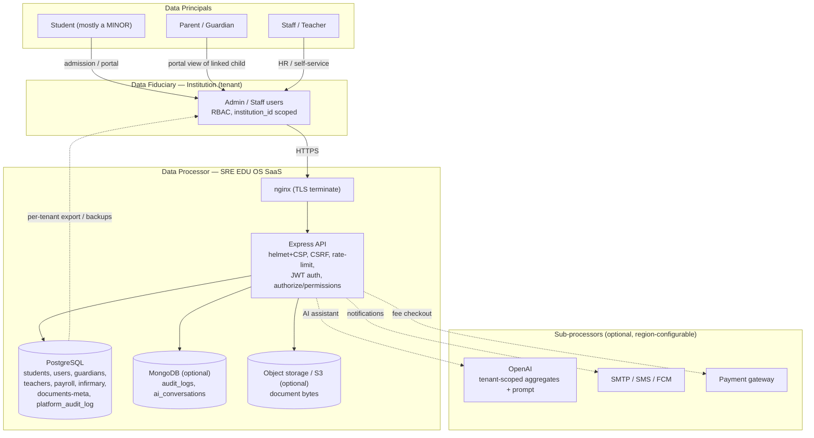

# DPDP Act 2023 Compliance Posture — SRE EDU OS (GoCampusOS)

> **Status:** Engineering mapping document, last reviewed 2026-06-26.
> **Disclaimer:** This document maps the codebase to the obligations of India's
> Digital Personal Data Protection Act, 2023 (DPDP) and the (then-)draft DPDP
> Rules. It is an engineering/compliance *gap analysis*, **not legal advice**.
> A qualified data-protection lawyer must review the operator's posture, contracts,
> and notices before any compliance claim is made to customers or the Data
> Protection Board of India.

Each claim below is grounded in repository code. Items are tagged:

- **[Implemented]** — present in code today (file cited).
- **[Operator-policy]** — the technical hooks may exist, but the obligation is met
  by a process/contract the SaaS operator and/or institution must establish.
- **[Gap]** — not built; tracked under "Gaps / Action required".

---

## 1. Purpose & scope

SRE EDU OS (a.k.a. GoCampusOS) is a **multi-tenant school/college ERP SaaS**.
Each institution is an isolated tenant keyed by `institution_id`
(`backend/src/db/migrations/0011_tenancy.sql`). The platform stores personal data
about students (the majority of whom are **minors**), their guardians/parents,
teaching and non-teaching staff, and login users.

**Role split under DPDP (critical):**

- The **institution** (school/college) determines *why* and *how* personal data is
  processed for its pupils and staff → it is the **Data Fiduciary**.
- The **SaaS operator** (the entity running SRE EDU OS) processes that data **on
  the institution's behalf and instructions** → it is a **Data Processor**.
- The two roles must be governed by a **Data Processing Agreement (DPA)**
  (Operator-policy — no DPA template ships in this repo).

A single super-admin tier operates *across* tenants (platform console, backups,
impersonation). Cross-tenant access is itself a high-risk processing activity and
is audited (see §6, §9).

### Data-flow diagram

---

## 2. Personal data inventory

Verified against the migrations in `backend/src/db/migrations/`. "Sensitivity"
is an engineering judgement, not a statutory classification (DPDP does not yet
enumerate "sensitive personal data" categories the way the GDPR does, but the
draft Rules give children's data and certain identifiers special treatment).

| Data category | Where (table / key columns) | Source migration | Notes / sensitivity |
|---|---|---|---|
| Login accounts | `users` — `email`, `password_hash`, `full_name`, `role`, `phone` | `0001_auth.sql` | Credentials; password stored **hashed**, never plaintext. High. |
| Auth/session security | `users.totp_secret`, `failed_login_attempts`, `locked_until`; `refresh_tokens.token_hash`, `user_agent`, `last_used_at` | `0045`, `0046`, `0010`, `0047` | TOTP secret is a credential; refresh tokens stored **SHA-256 hashed**. High. |
| Students (core) | `students` — `first_name`, `last_name`, `date_of_birth`, `gender`, `guardian_name/phone/email`, `address`, `admission_no` | `0002_academics.sql` | **Mostly minors.** `date_of_birth` enables age determination. High. |
| Students (profile v2) | `students` — `blood_group`, `nationality`, `religion`, `category`, `national_id`, `previous_school`, `emergency_contact_name/phone` | `0071_student_profile_v2.sql`, `0070` (`guardian_relation`) | `religion`, `category` (caste/quota), `national_id` (e.g. Aadhaar-class identifier), `blood_group` are especially sensitive. High. |
| Guardians (portal link) | `guardians` — `user_id`, `student_id`, `relationship` | `0016_guardians.sql` | Parent↔child mapping; basis for verifiable-parental-consent and parent portal access. High. |
| Prospective applicants | `admission_applications` — `first_name`, `last_name`, `date_of_birth`, `gender`, `guardian_name/phone/email`, `address` | `0049_admission_applications.sql` | PII of minors captured **before** enrollment (enquiry stage). High. |
| Staff / teachers | `teachers` — `first_name`, `last_name`, `email`, `phone`, `qualification`, `joining_date`, `employee_no` | `0002_academics.sql` | Adult employee PII. Medium-high. |
| Payroll | `salary_structures`, `salary_structure_components`, `payslips` (per `teacher_id`) | `0029_payroll.sql` | Financial/compensation data. High. |
| Health (infirmary) | `infirmary_visits` — `patient_name`, `complaint`, `treatment`, `temperature`, `remarks` (FK `student_id`) | `0054_infirmary_visits.sql` | **Health data of (often) minors.** Very high. |
| Grievance / feedback | `feedback_entries` — `subject`, `message`, `submitter_name`, `submitter_contact`, `type` ∈ {feedback, complaint, suggestion, grievance} | `0053_feedback_entries.sql` | Free-text may contain PII. Medium. |
| Uploaded documents | `documents` — `original_name`, `mime_type`, `storage_key`, `owner_type/id` (student\|user\|institution\|message) | `0019_documents.sql` | Certificates, ID cards, photos. Bytes in object storage; only private `storage_key` stored. High. |
| AI assistant chats | MongoDB `ai_conversations` (`userId`, `institutionId`, message text) | `backend/src/modules/ai/ai.service.ts` | Staff-authored prompts; optional MongoDB. Medium. |
| Audit trails | `platform_audit_log` (actor email/role/ip); MongoDB `audit_logs` (userId, ip, path) | `0039_platform_hardening.sql`, `backend/src/middleware/audit.ts` | Contains IP + actor identity. Medium. Retained for security. |

> Additional tenant-scoped tables (attendance, exams, fees, transport, hostel,
> library, disciplinary, visitor logs, etc.) also reference `student_id`/`user_id`
> and therefore carry personal data by association. They inherit the same tenant
> isolation and deletion-cascade behaviour described below.

---

## 3. Roles under DPDP mapped to the system

| DPDP role | System mapping |
|---|---|
| **Data Principal** | The student (a *child* Data Principal where < 18), the parent/guardian, the staff member, or any login user whose data is processed. |
| **Data Fiduciary** | The **institution** (tenant). It decides what to collect at admission, who may access it (RBAC), and retention. Identified by `institutions` row (`0011_tenancy.sql`); `type` ∈ {school, college}. |
| **Data Processor** | The **SaaS operator** running SRE EDU OS, processing on the Fiduciary's instructions. Bound by a DPA *(Operator-policy)*. Sub-processors: see §8. |
| **Consent Manager** | **Not implemented.** DPDP envisions a registered Consent Manager intermediary; the app has no integration. *(Gap — see §4.)* |
| **Significant Data Fiduciary** | A large institution/operator may be notified as an SDF (extra duties: DPO, audits, DPIA). *(Operator-policy — assess by scale.)* |

---

## 4. Lawful processing & consent

**What the app does today:**

- Captures applicant/student/guardian data at the admission and enrollment stages
  (`admission_applications`, `students`, inline guardian columns, parent-portal
  `guardians` linkage). See `backend/src/modules/students/students.service.ts`
  (shared `STUDENT_WRITE_COLUMNS`) and migration `0049`.
- Restricts who can read a child's data to staff and the linked
  student/parent accounts (owner-scoping in
  `backend/src/modules/documents/documents.service.ts` and
  `backend/src/utils/scope.ts`).

**What is NOT in the code (verified):**

- A **consent ledger / consent records table does not exist.** A repository-wide
  search for `consent` (case-insensitive) returns **no matches in application
  code**. There is no schema to store: the purpose a Principal consented to, the
  timestamp, the notice version shown, or a withdrawal event.
- No **itemised consent notice** UX (DPDP requires a clear, itemised notice in
  English or a Schedule-listed language, with the right to withdraw as easily as
  to give).
- No **verifiable parental consent** capture flow for minors (see §10).

> **Lawful basis note:** Some processing may rely on DPDP's "legitimate uses"
> (e.g. a subscribed service, employment, compliance with law) rather than
> consent — but admissions of minors generally require **verifiable parental
> consent**. The operator/institution must determine the basis per purpose and
> record it. *(Operator-policy + Gap.)*

---

## 5. Data Principal rights

| Right (DPDP §11–§14) | Existing capability | Status |
|---|---|---|
| **Right to access** (summary of data processed) | Admin/staff can view full records; a student/parent can view their own/linked records via the portal (owner-scoped, `scope.ts`, `documents.service.ts`). No single "download all my data" self-service report. | **[Partial]** — staff-mediated; no Principal-facing access bundle. |
| **Right to correction & completion** | `PATCH /students/:id` (`updateStudent`, shared write columns); profile-v2 fields editable; guardian inline + linked records editable; user/teacher edit endpoints exist. | **[Implemented]** for staff-driven correction; **[Gap]** for Principal self-service correction requests. |
| **Right to erasure** | `archiveStudent` (soft delete → `status='archived'`, `0007_student_soft_delete.sql`) and `hardDeleteStudent` (row delete, cascades to attendance/invoices/payments) in `students.service.ts`. FK `ON DELETE CASCADE`/`SET NULL` throughout means deleting a student/user purges or detaches dependents. | **[Partial]** — admin-initiated hard delete exists; **no Principal-facing erasure request workflow**, no cross-store erasure (MongoDB `audit_logs`/`ai_conversations`, object-storage orphans). |
| **Right of grievance redressal** | Generic `feedback_entries` tracker with `type='grievance'` (`0053`) and status workflow. | **[Partial]** — a tracker exists, but it is **not a designated DPDP grievance mechanism** and there is no published Grievance/Data-Protection Officer. *(Operator-policy.)* |
| **Right to nominate** (data of a deceased/incapacitated Principal) | No nominee field/flow. | **[Gap]** |
| **Data portability** (institution-level export) | `backups.service.ts` produces a per-tenant logical export (`scope='institution'`, gzipped JSON of every `institution_id` table) — useful for tenant offboarding/portability; super-admin only. | **[Implemented]** at the *Fiduciary* level; **[Gap]** at the individual-Principal level. |

---

## 6. Data security safeguards (reasonable security — DPDP §8(5))

All controls below were verified in code:

| Control | Evidence |
|---|---|
| **Password hashing** | bcrypt, 10 salt rounds — `backend/src/utils/password.ts`. Plaintext passwords are never stored (`users.password_hash`). |
| **Session tokens** | Short-lived access JWT (15m default) + opaque refresh token stored **SHA-256 hashed** (`0001_auth.sql`); **rotation with reuse detection** revokes all sessions on token theft (`0010_refresh_token_reuse.sql`); per-device session metadata + revoke (`0047_session_metadata.sql`). |
| **httpOnly auth cookies** | `httpOnly`, `secure` (in production), `sameSite='lax'` — `backend/src/utils/cookies.ts`. |
| **Account lockout** | Consecutive-failure counter + temporary lock (`failed_login_attempts`, `locked_until`, `0046`); thresholds in `env.ts` (`AUTH_MAX_FAILED_ATTEMPTS`, `AUTH_LOCKOUT_MINUTES`). |
| **Two-factor auth (TOTP)** | Opt-in authenticator-app 2FA — `0045_two_factor.sql`, enforced in `auth.service.ts` (`verifyTotp`). |
| **RBAC** | Role enum + permission catalogue + `role_permissions` grants (`0012`, `0042_rbac.sql`); `authenticate`/`authorize` (`backend/src/middleware/auth.ts`), fine-grained `permissions.ts`. |
| **Tenant isolation** | Every tenant query is scoped by `institution_id` in the SQL `WHERE` clause (application-level), enforced by `requireTenant`/`tenantId` (`backend/src/middleware/tenant.ts`) and `requireInstitutionType` (`institution-type.ts`). **Note:** isolation is *application-enforced, not Postgres Row-Level Security* — there is no RLS policy layer. |
| **Parameterised SQL** | All queries go through `query()`/`withTransaction()` (`backend/src/db/postgres.ts`); catalogue-sourced identifiers are re-validated (`ident()` in `backups.service.ts`). Mitigates SQL injection. |
| **File-upload validation** | MIME allowlist + extension match + dangerous-extension denylist + size cap — `documents.service.ts` (`assertValidFile`). Stored objects renamed to a random UUID; private `storage_key` never returned to clients. |
| **Transport security (TLS)** | nginx terminates HTTPS in production (certbot / `infra/nginx/prod.conf`, `enable-https.sh`); `secure` cookies require HTTPS. |
| **HTTP hardening** | `helmet` with explicit CSP (`object-src 'none'`, `base-uri 'self'`, `frame-ancestors 'none'`) — `backend/src/app.ts`; frontend sets its own stricter CSP (`frontend/next.config.mjs`). |
| **CSRF defense-in-depth** | Origin/Referer guard for cookie-authenticated state changes — `backend/src/middleware/csrf.ts` (layered on `SameSite=Lax`). |
| **Rate limiting** | Global + stricter auth limiter (`backend/src/middleware/rate-limit.ts`, `env.authRateLimitMax`). |
| **Durable security audit** | Security-significant events (logins, password resets, 2FA changes, admin recovery, backup/restore, impersonation) → `platform_audit_log` (`backend/src/utils/security-audit.ts`, `backups.service.ts`, `0039`). Curated, **never stores secrets/tokens/hashes**. |
| **Best-effort request audit** | Every mutating request → MongoDB `audit_logs` when configured (`backend/src/middleware/audit.ts`); degrades silently when MongoDB is absent. |
| **Secrets hygiene** | No secrets committed; production refuses dev-default JWT secrets (`requiredSecret` in `env.ts`); only `.env.example` templates ship. |

**Security gaps to note:** encryption **at rest** for the database/object storage is
a deployment/infra responsibility and is **not enforced by the application**
*(Operator-policy)*; there is **no field-level encryption** for high-sensitivity
columns such as `national_id` (stored as plaintext `TEXT`) *(Gap)*.

---

## 7. Data retention & deletion

**What exists:**

- **Student soft-delete / archive** preserves history while hiding the record
  (`archiveStudent`, `0007_student_soft_delete.sql`); `listStudents` excludes
  `archived` by default.
- **Hard delete with cascade** (`hardDeleteStudent`) removes a student and cascaded
  attendance/fees rows.
- **Backup retention pruning** keeps only the latest *N* successful backups and
  deletes older artifacts + rows (`applyRetention` in `backups.service.ts`);
  retention is **off** (nothing deleted) when `retention_count` is null.

**What is missing (Gap):**

- **No per-category retention schedule.** DPDP requires erasure once the purpose is
  served / consent withdrawn (subject to legal retention). There is no policy
  table, no TTL, and **no automated purge** of inactive students, ex-staff,
  applicant records, infirmary visits, AI chats, or audit logs.
- **Soft-delete is not erasure.** Archived students remain fully in the database.
- **Backups outlive deletions.** A Principal erased from the live DB may persist in
  retained backup artifacts until those backups rotate out — the operator must
  define how erasure requests interact with backups *(Operator-policy)*.

---

## 8. Cross-border transfer & sub-processors

DPDP permits cross-border transfer except to countries the Central Government may
restrict (blacklist model). Every third party below is **optional and degrades
gracefully when unconfigured** (verified in `backend/src/config/env.ts`):

| Sub-processor | Purpose | Config / behaviour | Data exposed |
|---|---|---|---|
| **OpenAI** | AI assistant / insights | `OPENAI_API_KEY` (optional); `ai.service.ts` sends only **tenant-scoped aggregate counts** (active students, attendance totals, fees) + the staff user's typed prompt — *not* raw student rows. Scoping is explicit to avoid cross-tenant leakage. | Aggregate stats + prompt text. **Likely a US transfer.** |
| **SMTP provider** | Transactional email (e.g. password reset) | `SMTP_*` (optional). | Recipient email, message content. |
| **SMS provider** | SMS notifications | `SMS_*` (optional, provider-agnostic, no-op when unset). | Phone number, message. |
| **FCM (push)** | Push notifications | `FCM_SERVER_KEY` (optional). | Device token. |
| **S3-compatible storage** | Uploaded files | `STORAGE_*` (optional; local disk fallback in dev). | Document bytes (certificates, photos, ID cards). |
| **Payment gateway** | Online fee checkout | `PAYMENT_GATEWAY_*` (optional; offline collection still works). | Payer/student identifiers, amounts. |

**Action (Operator-policy):** choose **India-region** providers/buckets where
required, execute sub-processor DPAs, maintain a sub-processor register, and
re-confirm OpenAI/SMTP/SMS/storage/payment regions per the institution's risk
appetite. No provider credentials are hardcoded anywhere in the repo.

---

## 9. Personal data breach notification

DPDP requires the Data Fiduciary to notify **both** the Data Protection Board of
India **and** each affected Data Principal of a personal-data breach (the draft
Rules prescribe form and timelines).

**What the code supports:**

- The durable `platform_audit_log` (`security-audit.ts`, `0039`) records logins,
  admin recovery, impersonation, and backup/restore actions with actor + IP —
  supporting **breach investigation and forensics**.
- The best-effort MongoDB request log adds method/path/status/IP coverage when
  configured.

**What the operator must establish (Operator-policy / Gap):**

- A written **incident-response & breach-notification runbook** (detection →
  containment → Board notice → Principal notice).
- A means to **enumerate affected Principals** for notification (the data exists,
  but no breach-scoping tooling is built).
- Log **retention, integrity, and monitoring/alerting** (no SIEM/alerting ships in
  this repo).

---

## 10. Children's data (DPDP §9 — heightened duties)

Most students are **minors (< 18)**, so DPDP's child-specific rules apply:
**verifiable parental consent** before processing, **no processing detrimental to
the child's wellbeing**, and **no tracking, behavioural monitoring, or targeted
advertising** directed at children.

**What is confirmed in the codebase:**

- **No advertising or behavioural-tracking technology is present.** A
  repository-wide search for ad/analytics SDKs (`google-analytics`, `gtag`,
  `googletagmanager`, `facebook`/`fbq`, `mixpanel`, `segment`, `amplitude`,
  `doubleclick`, `adsbygoogle`) finds **no integrations in application code** —
  the only hits are unrelated transitive entries in lockfiles. The product does
  not profile or target minors. **[Implemented — by absence.]**
- The parent↔child relationship needed to *route* consent exists
  (`guardians`, `0016`; `guardian_relation`, `0070`).
- `date_of_birth` is captured (`students`, `admission_applications`), so age can be
  determined for gating.

**Gaps for children's data:**

- **No verifiable-parental-consent mechanism.** There is no flow that verifies a
  consenting adult is the child's lawful guardian, no record of that consent, and
  no age-gate enforcing it before a minor's record is created.
- **No consent withdrawal** path for a parent.

---

## 11. Compliance checklist

Legend: ✅ Implemented · 🟡 Partial · ❌ Gap · 📋 Operator-policy

| # | Obligation | Status | Evidence / owner |
|---|---|---|---|
| 1 | Data Fiduciary / Processor roles defined + DPA in place | 📋 | DPA is operator/institution contract; not in repo |
| 2 | Personal-data inventory maintained | ✅ | §2 (this doc), migrations |
| 3 | Itemised consent notice (multi-language) | ❌ | No notice UX |
| 4 | Consent ledger (purpose, timestamp, withdrawal) | ❌ | No `consent` table/code |
| 5 | Verifiable parental consent for minors | ❌ | §10 |
| 6 | Right to access (Principal-facing) | 🟡 | Portal shows own/linked data; no export bundle |
| 7 | Right to correction | ✅ / 🟡 | `PATCH /students/:id`; no self-service request flow |
| 8 | Right to erasure | 🟡 | `hardDeleteStudent` + cascades; no Principal workflow, no cross-store/backup erasure |
| 9 | Grievance redressal + named officer | 🟡 / 📋 | `feedback_entries` tracker; no designated DPO |
| 10 | Right to nominate | ❌ | Not built |
| 11 | Data portability / tenant export | ✅ | `backups.service.ts` per-institution export |
| 12 | Password hashing | ✅ | bcrypt (`password.ts`) |
| 13 | Session security (hashed refresh, rotation, lockout, 2FA) | ✅ | `0010`, `0046`, `0045`, `auth.service.ts` |
| 14 | RBAC + tenant isolation | ✅ | `permissions.ts`, `tenant.ts` (app-level, no RLS) |
| 15 | TLS in transit | ✅ / 📋 | nginx/certbot (deployment) |
| 16 | Encryption at rest / field-level for identifiers | ❌ / 📋 | Infra responsibility; `national_id` plaintext |
| 17 | Input validation & parameterised SQL | ✅ | zod + `query()` |
| 18 | File-upload safety | ✅ | `assertValidFile` |
| 19 | HTTP hardening (helmet/CSP, CSRF, rate limit) | ✅ | `app.ts`, `csrf.ts`, `rate-limit.ts` |
| 20 | Durable security audit log | ✅ | `security-audit.ts` → `platform_audit_log` |
| 21 | Per-category retention schedule + automated purge | ❌ | Only backup retention exists |
| 22 | Cross-border / sub-processor governance (India-region) | 📋 | §8; providers optional, regions operator-chosen |
| 23 | Breach-notification runbook + affected-Principal enumeration | ❌ / 📋 | Audit log aids forensics only |
| 24 | No ad-tech / behavioural tracking of minors | ✅ | §10 (verified absent) |
| 25 | Significant Data Fiduciary duties (DPO, DPIA, audit) | 📋 | Assess by scale |

---

## Gaps / Action required (consolidated)

**Engineering (build):**

1. **Consent subsystem** — a `consents` table (principal, purpose, notice version,
   granted/withdrawn timestamps) + capture UX, surfaced at admission and in the
   portal. *(Checklist 3, 4.)*
2. **Verifiable parental consent + age gate** for minors before record creation.
   *(5.)*
3. **Principal-facing rights workflows** — "download my data" bundle, self-service
   correction & erasure requests with an audit trail, and a nominee field.
   *(6, 7, 8, 10.)*
4. **Cross-store erasure** — propagate a delete across MongoDB (`audit_logs`,
   `ai_conversations`), object storage, and a documented backup-purge policy.
   *(8, 21.)*
5. **Retention engine** — per-category retention periods + an automated purge job
   (the job worker in `backend/src/modules/jobs/` is a natural host). *(21.)*
6. **Field-level encryption** for `national_id` and other high-sensitivity
   identifiers; consider Postgres RLS to harden tenant isolation. *(16, 14.)*
7. **Breach tooling** — query to enumerate Principals affected by a scoped breach;
   log retention + alerting. *(23.)*

**Operator / institution (policy & contracts):**

8. Execute a **DPA** (operator↔institution) and **sub-processor DPAs**; maintain a
   sub-processor register; select **India-region** providers where required.
   *(1, 22.)*
9. Publish a **privacy notice** and appoint/communicate a **Grievance / Data
   Protection Officer**; wire the feedback tracker (or a successor) to that role.
   *(3, 9.)*
10. Stand up an **incident-response & breach-notification runbook** (Board +
    Principal notice). *(23.)*
11. Ensure **encryption at rest** for Postgres and object storage at the infra
    layer; verify TLS configuration. *(15, 16.)*
12. Assess **Significant Data Fiduciary** status by scale and, if applicable,
    appoint a DPO, run DPIAs, and commission independent audits. *(25.)*

---

## 12. Disclaimer

This document is an internal engineering-to-DPDP mapping prepared to guide
remediation. It does **not** constitute legal advice and does **not** assert that
SRE EDU OS or any operator is DPDP-compliant. The DPDP Act 2023 and its Rules,
together with the institution-specific facts (lawful bases, contracts, hosting
regions, scale), must be reviewed by qualified legal counsel before any compliance
representation is made to customers, regulators, or the Data Protection Board of
India.
