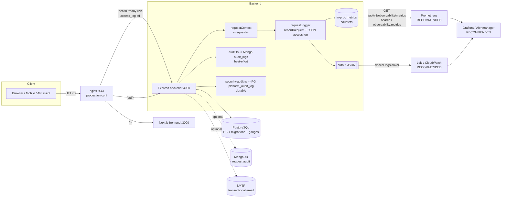

# Monitoring & Observability Runbook — SRE EDU OS (GoCampusOS)

> **Scope:** operational monitoring for the multi-tenant school/college ERP
> (Express 5 + PostgreSQL backend, Next.js frontend, nginx, single-VPS Docker
> Compose deploy). This is the runbook for *operating and alerting*; the
> feature-level reference is [`docs/modules/observability-module.md`](modules/observability-module.md).
>
> **IMPLEMENTED vs RECOMMENDED:** sections 1–6 describe signals that **exist in
> the code today**. Sections 7–9 mix *existing signals* with *external tooling you
> must set up* — each item is tagged. Read the code (`backend/src/...`) as the
> source of truth; endpoint/metric names below are verified against it.

---

## 1. Overview — the three pillars

| Pillar | What this system provides today | Where |
| --- | --- | --- |
| **Metrics** | In-process Prometheus counters (requests, 5xx errors, request-duration summary, jobs, backups, restores, cache) merged at scrape time with **live DB gauges** (job queue depth, scheduled-report runs, stored-backup count, last-backup timestamp). Exposed as Prometheus text exposition. | `backend/src/observability/metrics.ts`, `backend/src/modules/observability/observability.service.ts` (`renderMetrics`) |
| **Logs** | Structured **single-line JSON to stdout** — one access-log line per request (curated, secret-free fields) plus app warnings/errors. Designed for stdout → Docker logging driver → an aggregator. | `backend/src/utils/logger.ts`, `backend/src/middleware/request-logger.ts` |
| **Traces / correlation** | No distributed tracing. Instead, a **per-request correlation id** (`x-request-id`) is generated (or reused from the inbound header), attached to every access-log line, and echoed back in the response header — enough to trace one request end-to-end across client and logs. | `backend/src/middleware/request-context.ts` |

Two durable **audit trails** sit alongside the pillars (section 5): a Postgres
security/platform audit (`platform_audit_log`) and a best-effort MongoDB request
audit (`audit_logs`).



---

## 2. Health & readiness probes

Three **public, unauthenticated, secret-free** probes are mounted at the app root
in `backend/src/app.ts`. They are deliberately not under `/api/v1` and not
rate-limited the same way, so orchestrators and load balancers can poll them.

| Probe | Status codes | What it checks | Body |
| --- | --- | --- | --- |
| `GET /health` | **200** `ok` / **503** `degraded` | Postgres reachability (`pool.query("SELECT 1")`). Mongo presence and uptime are **reported but never affect the status code**. | `{ status, postgres, mongo, uptime }` |
| `GET /ready` | **200** / **503** (`ready:false`) | **Critical:** `database` (`SELECT 1`) **and** `migrations` (`count(*) > 0` in `schema_migrations`). **Reported-only (never fail readiness):** `jobQueue` (`"disabled"` unless `JOB_WORKER_ENABLED`), `storage` (`"local"` unless `STORAGE_BUCKET`). | `{ ready, checks:{ database, migrations, jobQueue, storage } }` |
| `GET /live` | **always 200** (never 503) | Nothing external — proves the event loop is responsive. | `{ status:"ok", uptimeSeconds }` |

Implementations: `readiness()` and `liveness()` in
`backend/src/modules/observability/observability.service.ts`; `/health` is inline
in `app.ts`.

**Semantics that matter for alerting:**
- `/health` 503 ⇒ **Postgres is down** (hard outage — page).
- `/ready` 503 with `migrations:false` ⇒ migrations not applied; the backend
  runs `runMigrations()` on boot (`server.ts`), so this should self-resolve after
  a deploy — if it persists, the migration step failed.
- `/live` never reflects dependency health; use it **only** as the
  restart/liveness probe so a transient DB blip doesn't trigger a pod/container
  kill.

**nginx routing** (`infra/nginx/production.conf`):
```nginx
# Public health/readiness probes (no secrets, no auth).
location ~ ^/(health|ready|live)$ {
    set $probe_upstream backend:4000;
    proxy_pass http://$probe_upstream;
    proxy_set_header Host $host;
    access_log off;          # probes don't pollute the access log
}
```
All three are reachable through the proxy in **this repo's** `production.conf`.

> ⚠️ **Live-VPS caveat:** the VPS's nginx config is *server-local and may differ*
> (CLAUDE.md: "keep the VPS copy, do not overwrite"). The existing module doc
> notes the live VPS historically exposed **only `/health`** publicly (`/ready`,
> `/live` → 404 through that proxy). **Verify against the running VPS** before
> pointing an external uptime checker at `/ready` or `/live`; `/health` is the
> safe target everywhere.

**Recommended probe wiring:**
- Container/orchestrator **liveness** → `/live` (cheap, no deps).
- Container/orchestrator **readiness / startup** → `/ready` (gates traffic until
  DB + migrations are up).
- Docker Compose `healthcheck` and external uptime monitors → `/health`
  (single signal that also reflects DB).

---

## 3. Metrics

### Endpoint (verified)

```
GET /api/v1/observability/metrics
```
- **Auth:** `authenticate` (bearer JWT) **+** `requirePermission("observability:metrics")`.
  Only `super_admin` holds the `observability:*` keys (seeded in
  `0041_observability.sql`); every tenant role gets **403**.
- **Content-Type:** `text/plain; version=0.0.4` (standard Prometheus exposition).
- **Routing:** matches nginx `location /api/`, so it is reachable through the
  proxy (it is *not* one of the public probes) — the scraper still needs a valid
  super-admin bearer token.

Sibling super-admin endpoints (`observability.routes.ts`):
- `GET /api/v1/observability/health` — detailed health JSON (DB/Mongo, migration
  count, queue depth by status, worker/storage config). Perm `observability:health`.
- `GET /api/v1/observability/overview` — aggregated request/error/job/queue/
  scheduled-report/cache/backup summary + last 10 failed jobs. Perm `observability:read`.

### Metrics exposed (exact names from `renderMetrics()`)

| Metric | Type | Notes |
| --- | --- | --- |
| `http_requests_total` | counter | Plus `http_requests_total{class="2xx\|4xx\|5xx"}` |
| `http_request_errors_total` | counter | Responses with status ≥ 500 |
| `http_request_duration_ms_sum` / `http_request_duration_ms_count` | summary | Derive avg = sum/count; **no percentiles/histogram** |
| `jobs_processed_total{result="success\|failed\|retry"}` | counter | In-process |
| `jobs_queue_depth{status="pending\|running\|success\|failed\|cancelled"}` | gauge | **Live from `jobs` table** |
| `scheduled_report_runs_total{status="..."}` | gauge | Live from `scheduled_report_runs` |
| `cache_hits_total` / `cache_misses_total` / `cache_invalidations_total` | counter | From `cacheStats()` (`backend/src/cache/cache.ts`) |
| `cache_entries` | gauge | Live cache size |
| `backups_total{result="success\|failed"}` / `restores_total{result="..."}` | counter | In-process |
| `backups_stored` | gauge | Retained successful backups (live from `backups`) |
| `backup_last_success_timestamp_seconds` | gauge | Unix secs of last successful backup; **0 if none** — key for backup-age alerts |

> **Counters are per-process and reset on restart** (`metrics.ts` is in-memory).
> Prefer the **DB-backed gauges** for anything that must survive restarts, and
> scrape frequently. There is no multi-instance aggregation — fine for the
> single-VPS target; a horizontally-scaled deploy would need a shared metrics
> backend.

### Sample Prometheus `scrape_config` (RECOMMENDED-SETUP)

```yaml
scrape_configs:
  - job_name: gocampusos-backend
    metrics_path: /api/v1/observability/metrics
    scheme: https
    scrape_interval: 30s
    static_configs:
      - targets: ["gocampusos.com"]
    # The endpoint requires a super-admin bearer token + observability:metrics.
    authorization:
      type: Bearer
      credentials_file: /etc/prometheus/gocampusos_token   # long-lived super-admin JWT
```
Mint a dedicated super-admin service token, store it in
`credentials_file` (never inline), and rotate it. If you front this with an
internal-only path, you can additionally IP-restrict in nginx.

### Platform KPIs via `GET /api/v1/observability` siblings + `/platform/kpis`

`GET /api/v1/platform/kpis` (super_admin, perm `platform:usage_read`,
`platform.service.ts → platformKpis()`) returns **cross-tenant business KPIs**
(not Prometheus — JSON for the super-admin console):

`totalInstitutions`, `activeInstitutions`, `suspendedInstitutions`,
`totalStudents`, `totalStaff`, `totalUsers`, `feesOutstanding`,
`onlinePaymentsTotal`, `totalDocuments`, `storageBytes`, `scheduledReports`,
`customReports`, `activeSessions` (non-revoked, unexpired refresh tokens), plus
`moduleAdoption` (`withStudents`, `withFees`, `withOnlinePayments`, `withLibrary`,
`withScheduledReports`). Scrape these into a dashboard via a small exporter if you
want them in Prometheus, or just render them in the console.

---

## 4. Structured logging

`backend/src/utils/logger.ts` emits **one JSON object per line to stdout**
(stderr for `error`). It is suppressed under `NODE_ENV=test`. Callers pass only
curated fields — **never headers, bodies, query strings, tokens, passwords, or
payment data** — so logs cannot leak secrets by construction.

### Access-log shape (`buildAccessLog` in `request-logger.ts`)

Emitted on every response `finish`, at level `error` when status ≥ 500 else
`info`:

```json
{"level":"info","ts":"2026-06-26T09:15:42.317Z","msg":"request","requestId":"3f1c…UUID","method":"POST","path":"/api/v1/students","status":201,"durationMs":48,"userId":"…","institutionId":"…","role":"admin","ip":"203.0.113.7","userAgent":"Mozilla/5.0 …"}
```

Fields: `requestId` (= `x-request-id`), `method`, `path` (**query string
stripped** so `?token=…` never lands in logs), `status`, `durationMs`, `userId`,
`institutionId`, `role`, `ip` (honours `trust proxy`), `userAgent`. Anonymous
requests carry `null` user context.

### Correlation id (`x-request-id`)

`requestContext` runs **first** in the middleware chain: it reuses a sane inbound
`x-request-id` (regex `^[\w.\-]{1,200}$`) or generates a `crypto.randomUUID()`,
stores it on `req.requestId`, and sets it on the response header. To trace an
issue end-to-end: read `x-request-id` from the client/response, then grep the log
aggregator for that id.

### Shipping logs (RECOMMENDED-SETUP)

Logs go to **stdout/stderr only** — there is no file or remote sink in code. Ship
them via the container runtime:
- **Loki:** Docker logging driver `loki`, or run **Promtail/Grafana Alloy** to
  tail the Docker JSON logs. Parse `msg="request"` lines as JSON; index on
  `status`, `role`, `institutionId`, `requestId`.
- **CloudWatch / GCP / ELK:** point the Docker `awslogs`/`gcplogs`/`fluentd`
  driver at the backend container.
- Because every line is already JSON, **no regex parsing is needed** — configure
  the pipeline as JSON and the fields are immediately queryable.

---

## 5. Audit trails

There are **two distinct audit stores** with different durability guarantees —
do not conflate them.

### 5a. Durable security/platform audit — `platform_audit_log` (PostgreSQL)

- **Code:** `backend/src/utils/security-audit.ts` (`recordSecurityEvent`) and the
  platform console (`platform.service.ts` writes platform actions to the same
  table). Schema in `0039_platform_hardening.sql` (+ `0042_rbac.sql`).
- **Always available** — survives a MongoDB outage / Mongo being unconfigured.
  Writes are **best-effort but never throw into the request path** (an audit
  failure must not block a login); on error it `console.error`s and continues.
- **Never contains secrets** — no passwords/tokens/hashes, only a curated
  `detail` JSONB. Rows are tenant-attributable via `institution_id`.
- **Columns:** `action` (namespaced), `target_type`, `target_id`,
  `institution_id`, `actor_id`, `actor_email`, `actor_role`, `detail`, `ip`,
  `created_at`.
- **Events recorded today** (verified in `auth.routes.ts` / `platform.routes.ts`):
  `auth.login.success`, `auth.login.failed` (with `detail.reason`),
  `auth.password.reset_requested`, `auth.password.reset_completed`,
  `auth.password.changed`, `auth.2fa.enabled`, `auth.2fa.disabled`,
  `platform.email.test`, `impersonate.start`, and the platform institution/RBAC
  mutations. (Account lockout state lives on `users.failed_login_attempts` /
  `users.locked_until` — migration `0046_account_lockout.sql` — and correlates
  with bursts of `auth.login.failed`.)

**How to query / inspect:**
- API (super_admin, perm `platform:audit_read`):
  `GET /api/v1/platform/audit?action=auth.login.failed&institutionId=…&dateFrom=…&dateTo=…`
  (filters: `institutionId`, `actorId`, `action`, `targetType`, `dateFrom`,
  `dateTo`; ordered newest-first, default limit 100).
- Direct SQL for incident response:
  ```sql
  SELECT created_at, action, actor_email, ip, detail
  FROM platform_audit_log
  WHERE action = 'auth.login.failed' AND created_at > now() - interval '15 min'
  ORDER BY created_at DESC;
  ```

### 5b. Best-effort request audit — `audit_logs` (MongoDB)

- **Code:** `backend/src/middleware/audit.ts`, mounted on `/api/v1` after rate
  limit + CSRF.
- **Mutations only** — skips `GET`/`OPTIONS`/`HEAD`. Writes on response
  `finish`; **silently skipped when MongoDB is not connected** (Mongo is an
  optional dependency).
- **Fields:** `method`, `path`, `module` (derived from the segment after `v1`),
  `statusCode`, `userId`, `userRole`, `institutionId`, `ip`, `createdAt`.
- **Query:** Mongo, e.g.
  `db.audit_logs.find({ module: "payroll", statusCode: { $gte: 400 } }).sort({ createdAt: -1 })`.
- **Treat as lossy:** it is not durable across a Mongo outage and is not the
  system of record for security events — that is 5a.

---

## 6. SMTP / email health

Transactional email (password reset, notifications) is an **optional dependency**
that degrades gracefully (`backend/src/utils/mailer.ts`: a missing
`SMTP_HOST` ⇒ `transporter === null`, sends become no-ops with a warning).

**Boot-time verification (`backend/src/server.ts`):** on startup the server calls
`verifyMailer()` and logs one of:
- `SMTP not configured — transactional email (password reset, notifications) is disabled` (warn)
- `SMTP configured but verification FAILED: <error>` (warn)
- `SMTP verified — transactional email is deliverable` (log)

So a misconfiguration **surfaces in boot logs** instead of silently dropping
every reset email. Non-fatal — the server still starts.

**Runtime endpoints (super_admin, perm `platform:health_read`):**
| Endpoint | Behaviour |
| --- | --- |
| `GET /api/v1/platform/email/status` | Calls `verifyMailer()` → `{ configured, ok, error? }` (live SMTP connectivity check, **no secrets**). |
| `POST /api/v1/platform/email/test` `{ "to": "you@example.com" }` | Sends a real test email; **503** `{ ok:false, error:"SMTP is not configured" }` if unconfigured; otherwise `{ ok, error? }`. **Audited** as `platform.email.test` (records `to` + `ok`). |

**Monitoring approach:** poll `/platform/email/status` on a schedule (blackbox
exporter with a super-admin token, or a cron that alerts on `ok:false`); grep boot
logs for the FAILED line after each deploy.

---

## 7. Recommended alerts

Legend — **Signal:** ✅ exists in code today · ⚙️ derive from an existing endpoint/metric · 🔧 needs external tooling (no in-app signal).

| # | Alert | Condition | Signal | Source |
| --- | --- | --- | --- | --- |
| 1 | **Probe down / app unreachable** | `/health` non-200 or no response for 2m | ✅ | `/health` (Uptime Kuma / blackbox) |
| 2 | **Postgres down** | `/health` 503 (`postgres:false`) or `/ready` `database:false` | ✅ | `/health`, `/ready` |
| 3 | **Migrations not applied** | `/ready` 503 with `migrations:false` for >5m post-deploy | ✅ | `/ready` |
| 4 | **High 5xx rate** | `rate(http_request_errors_total[5m])` or 5xx/total ratio > threshold | ⚙️ | `http_request_errors_total`, `http_requests_total{class="5xx"}` |
| 5 | **High latency** | `http_request_duration_ms_sum / http_request_duration_ms_count` > N ms over 10m | ⚙️ (avg only) | duration summary (no p95 in-app) |
| 6 | **Job queue backing up / failures** | `jobs_queue_depth{status="pending"}` rising, or `increase(jobs_processed_total{result="failed"}[15m])>0` | ✅ | metrics; `/observability/overview` recent failures |
| 7 | **Backup too old** | `time() - backup_last_success_timestamp_seconds > 26h` (or `==0`) | ✅ | `backup_last_success_timestamp_seconds` |
| 8 | **Restore failure** | `increase(restores_total{result="failed"}[1h])>0` | ✅ | `restores_total` |
| 9 | **SMTP failing** | `/platform/email/status` `ok:false` while `configured:true` | ✅ | `/platform/email/status`; boot log |
| 10 | **Failed-login / lockout spike** | sustained `auth.login.failed` per IP/account in window | ✅ (data) / 🔧 (alerting) | `platform_audit_log`; `users.locked_until` |
| 11 | **Cache miss ratio anomaly** | `misses/(hits+misses)` jumps (cold cache after restart, or thrash) | ⚙️ | `cache_hits_total` / `cache_misses_total` |
| 12 | **Mongo audit degraded** | `mongo:false` in `/health` while expected on | ✅ (flag) / 🔧 | `/health`, `/observability/health` |
| 13 | **TLS cert expiry** | cert < 21 days to expiry | 🔧 | blackbox `probe_ssl_earliest_cert_expiry`; certbot is server-local |
| 14 | **Disk space low** | host disk > 85% (backups/uploads/PG grow on the VPS) | 🔧 | node_exporter (no in-app signal) |
| 15 | **Container restart loop** | backend restarts repeatedly | 🔧 | Docker/cAdvisor; correlate with boot logs |

> Alerts 10 and 13–15 have **no native alerting path** in the app — wire them via
> Prometheus rules over the audit table (export it), blackbox_exporter, and
> node_exporter respectively.

---

## 8. Suggested stack

### Option A — single-VPS, self-hosted (matches the current deploy) — RECOMMENDED-SETUP

Add a small observability compose stack alongside the app on the VPS:
- **Prometheus** — scrape `/api/v1/observability/metrics` (bearer token) + a
  blackbox_exporter for `/health` and TLS expiry + node_exporter for host disk/CPU.
- **Grafana** — dashboards (section 9) + Alertmanager for routing.
- **Loki + Promtail/Alloy** — tail the backend container's stdout JSON logs.
- **Alertmanager** — route pages (Postgres/probe down, backup-age) vs warnings.

Lightest possible: **Uptime Kuma** alone for `/health` + `/platform/email/status`
+ cert expiry if you only want black-box up/down + notifications and not full
metrics. Good first step; doesn't capture the rich Prometheus metrics.

### Option B — managed — RECOMMENDED-SETUP

- **Metrics/logs/alerts:** Grafana Cloud, Datadog, or New Relic agent on the VPS;
  remote-write the same `/observability/metrics` and forward Docker logs.
- **Black-box uptime + cert:** UptimeRobot / Better Stack against `/health`.
- **Log retention/search:** CloudWatch Logs or Datadog Logs via the Docker driver.

> **What is IMPLEMENTED:** the metrics endpoint, the probes, the JSON logs, the
> two audit stores, and the SMTP status/test endpoints. **Everything in this
> section is setup you provision** — there is no bundled Prometheus/Grafana/Loki
> in the repo's compose files today.

---

## 9. Dashboards (panels to build)

**Golden signals (per the four SRE signals):**
- **Traffic:** `rate(http_requests_total[5m])`, split by `class`.
- **Errors:** 5xx rate and ratio (`http_request_errors_total`,
  `http_requests_total{class="5xx"}` / total).
- **Latency:** avg request duration (sum/count). *(Note the limitation: no
  histogram/percentiles in-app — add request-duration histograms if p95/p99
  matters.)*
- **Saturation:** `jobs_queue_depth` by status; `cache_entries`; host
  CPU/mem/disk (node_exporter).

**Platform / per-tenant KPIs (from `/platform/kpis`):**
- Institutions: total / active / suspended; module-adoption funnel.
- Students / staff / users; `activeSessions`.
- `feesOutstanding`, `onlinePaymentsTotal`, `storageBytes` trend.

**Jobs & backups:**
- `jobs_processed_total` by result; recent failures from `/observability/overview`.
- `backup_last_success_timestamp_seconds` age; `backups_stored`; restore results.

**Auth / security events (from `platform_audit_log`):**
- `auth.login.failed` rate by IP/account; lockouts (`users.locked_until`).
- 2FA enable/disable, password resets, impersonation starts.
- SMTP `ok` status over time + last `platform.email.test` result.

**Logs (Loki):**
- Live tail of `msg="request"` filtered by `status>=500` or `institutionId`.
- One-click pivot from a `requestId` to all lines sharing it.

---

## 10. Operational checklist

**Daily / automated**
- [ ] `/health` green (alert #1/#2) and `/ready` ready.
- [ ] Last successful backup < 26h (`backup_last_success_timestamp_seconds`, #7).
- [ ] No new failed jobs / failed restores (`/observability/overview`).
- [ ] 5xx rate and avg latency within baseline (#4/#5).

**On every deploy**
- [ ] Boot logs show migrations applied and `SMTP verified …` (not FAILED).
- [ ] `/ready` returns `migrations:true` within a few minutes.
- [ ] Confirm `production.conf` (or the **server-local** VPS nginx) still routes
      `/health` (and probes you rely on) — VPS nginx is not overwritten by the repo.
- [ ] Re-mint/rotate the Prometheus super-admin scrape token if rotated.

**Weekly**
- [ ] Review `auth.login.failed` / lockout trends in `platform_audit_log` (#10).
- [ ] TLS cert > 21 days (#13); certbot renewal healthy (server-local).
- [ ] Host disk < 85% (#14) — backups, uploads, and Postgres grow over time.
- [ ] Spot-check Mongo audit (`audit_logs`) is being written if Mongo is enabled.

**Incident response quick refs**
- App down → check `/health` (Postgres?), then container/boot logs.
- "Emails not arriving" → `GET /platform/email/status`, then `POST /platform/email/test`.
- Trace one bad request → grab `x-request-id`, grep the log aggregator.
- Security review → `GET /platform/audit` (durable) or SQL on `platform_audit_log`.

---

### Known gaps (be explicit)
- **No distributed tracing**; correlation is via `x-request-id` only.
- **No latency percentiles** — only a sum/count summary (avg).
- **Metrics counters are per-process** and reset on restart; no multi-instance
  aggregation (DB gauges are the durable values).
- **No bundled alerting/dashboards/log sink** in the repo — Prometheus, Grafana,
  Loki, blackbox/node exporters, cert/disk/restart alerts are all
  RECOMMENDED-SETUP you provision.
- `auth.login.failed`/lockout data exists but has **no built-in alert**; export
  `platform_audit_log` to your alerting backend.
