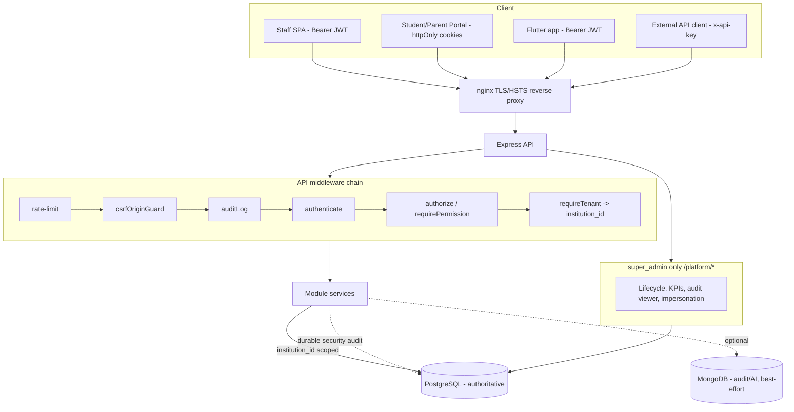

# SaaS Production-Readiness Audit — SRE EDU OS (GoCampusOS)

**Date:** 2026-06-26 · **Scope:** full monorepo (`backend/`, `frontend/`,
`mobile/`, `infra/`, CI/CD, docs) · **Method:** file-by-file scan of routes,
services, middleware, migrations, frontend pages, and config — claims are grounded
in real files, not assumptions.

**Headline:** the platform is **substantially more mature than a greenfield
audit assumes**. Multi-tenancy, auth/token security, RBAC, durable platform audit,
observability probes, an in-app backup/restore module, and a broad CI pipeline
already exist. This pass found **one genuine isolation bug (AI assistant — now
fixed)** and added durable security audit, CSRF defense-in-depth, CSP, SMTP
validation, CI security scanning, and OS-level backup scripts. The largest real
gaps are **SaaS billing automation** and **DPDP consent/retention** — both
documented with phased plans rather than half-built.

**Overall readiness: ~8.5/10** for institution management on a single-tenant-aware
VPS; **~6.5/10** for at-scale commercial SaaS (billing automation + per-tenant
metering + full CSP are the differences). See §20 for the scorecard.

---

## How to read this
Each area gives: **Status** · **Files** · **Risks** · **Missing** · **Fix** ·
**Priority (P0/P1/P2)** · **Implemented now vs Documented/Planned**.

- **Implemented now** = code is in the repo and typechecks/tests pass.
- **Documented/Planned** = a runbook/plan exists; operator action or a future
  phase is required.

---

## VERDICTS (the hard questions)

### V1 — Is tenant isolation real? **YES** (one bug found & fixed)
- Tenant = institution. JWT carries `institutionId` (`middleware/auth.ts`);
  `requireTenant`/`tenantId(req)` enforce it (`middleware/tenant.ts`), and
  **super_admin is explicitly rejected from tenant routes** (has `institutionId =
  null`). Data is scoped by `institution_id` at the query layer (directly, or via
  `student_id → students.institution_id` for `invoices`/`payments`/
  `attendance_records`, which carry no direct column). Owner-scoping for
  students/parents in `utils/scope.ts`. File uploads namespaced by institution.
  Covered by `tests/integration/isolation.int.test.ts` (+ `access`, `rbac`,
  `permissions`).
- **Bug found & fixed (P1):** `modules/ai/ai.service.ts` `schoolContext()` ran
  unscoped `count(*)`/`sum()` across ALL institutions and `/ai/assistant` lacked
  `requireTenant` — leaking cross-tenant aggregates to staff (and to the model
  provider). **Fixed in this pass.**

### V2 — Are tokens hashed? **YES**
| Secret | Storage | Table / column | Evidence |
|---|---|---|---|
| User password | bcrypt (10 rounds) | `users.password_hash` | `utils/password.ts` |
| Refresh token | **SHA-256**, rotated, reuse-detected | `refresh_tokens.token_hash` | `auth.service.ts` |
| Password-reset token | **SHA-256**, single-use (`used_at`), 60m | `password_reset_tokens.token_hash` | `0044_password_reset_tokens.sql` |
| API key | **SHA-256**, prefix shown for ID | `api_keys.key_hash` (+`key_prefix`) | `0065_integrations.sql`, `integrations.service.ts` |
| Access token (JWT) | not stored (stateless, 15m) | — | `utils/jwt.ts` |
| 2FA TOTP secret | stored to verify codes | `users` (totp) | `0045_two_factor.sql` |
| Webhook signing secret | **plaintext** (must be recoverable for HMAC) | `webhook_endpoints.secret` | `0068_webhook_delivery.sql` |

> The webhook secret is *correctly* not hashed — outbound HMAC signing needs the
> original key. The right hardening is **encryption at rest** (P1), not hashing.

### V3 — RBAC maturity? **Production-ready (coarse-but-correct)**
Granular `module:action` permissions, seeded catalogue, 60s cache with explicit
invalidation, `authorize()` + `requirePermission()` guards, super_admin bypass,
platform `platform:*` permissions never granted to tenant roles. Frontend guards
are cosmetic; backend is authoritative. Limitations (by design): 6 fixed roles, no
per-user custom roles, no ABAC, no time-boxed grants.

### V4 — Backup & restore? **YES (two layers), scheduling is operator-set**
In-app Backups module (super-admin: manual/scheduled/restore-preview/restore/
retention/institution-export) **plus** new OS-level scripts (`scripts/backup-db.sh`,
`restore-db.sh`, `verify-backup.sh`). **Gap:** no cron/systemd shipped (operator
wires it — snippets in `docs/BACKUP_DR.md`); no offsite/encryption automation; no
WAL/PITR; Mongo has no in-repo tooling (acceptable — audit mirror lives in
Postgres `platform_audit_log`).

### V5 — Monitoring/observability? **YES (probes + metrics + structured logs)**
`/health`, `/ready`, `/live` (`app.ts`); Prometheus metrics at
`GET /api/v1/observability/metrics` (super_admin + `observability:metrics`);
structured JSON logs with `x-request-id`; durable + best-effort audit trails;
new `GET/POST /platform/email/*` for SMTP health. **Gaps:** no tracing, no latency
percentiles, in-process counters reset on restart, no bundled alerting/dashboards
(see `docs/MONITORING.md`).

### V6 — DPDP (India privacy)? **PARTIAL — strong security, weak consent/retention**
Security safeguards are real (encryption-in-transit, hashing, RBAC, isolation,
audit). **Gaps (P1):** no consent ledger, no verifiable parental consent for minors
(most students are minors), no per-category retention/auto-purge, no
Principal-facing access/erasure workflow, `national_id` stored plaintext (no
field-level encryption/RLS). No ad-tech/tracking exists (good). See
`docs/DPDP_COMPLIANCE.md`. Requires legal review.

---

## PHASE-1 FILE-BY-FILE AUDIT (by area)

### A. Authentication & sessions
- **Status:** ✅ Strong. **Files:** `modules/auth/*`, `utils/{jwt,password,cookies}.ts`,
  migrations `0001/0044/0045/0046/0047`. **Risks:** no 2FA recovery codes; admin
  "create user" doesn't enforce the self-service password policy. **Fix:** add
  recovery codes; share the zod password rule. **Priority:** P1 / P2.
  **Implemented now:** durable audit of login/reset/2FA/change events (added).

### B. Authorization / RBAC
- **Status:** ✅ Mature. **Files:** `middleware/{auth,permissions}.ts`, migrations
  `0012/0042`. **Risks:** none material. **Missing:** per-user roles/ABAC (by
  design). **Priority:** P2. **Documented:** `docs/ROLES_AND_PERMISSIONS.md`.

### C. Multi-tenancy
- **Status:** ✅ with the AI bug fixed. **Files:** `middleware/{tenant,institution-type}.ts`,
  `utils/scope.ts`, service queries. **Risks:** future modules must remember to
  scope; consider a lint/test guard. **Priority:** P1 (the fix), P2 (guardrail).
  **Implemented now:** AI scoping fix + Mongo `institutionId` stamping.

### D. AI assistant
- **Status:** ✅ after fix. **Files:** `modules/ai/*`. **Risk (was):** cross-tenant
  aggregate leak to staff + model provider. **Fix:** `requireTenant` + scoped
  queries (done). **Priority:** P1. **Implemented now.**

### E. Security hardening (headers/CSRF/CSP/rate-limit/uploads)
- **Status:** ✅ improved. **Files:** `app.ts`, `middleware/{csrf,rate-limit}.ts`,
  `modules/documents/*`, `infra/nginx/*`, `frontend/next.config.mjs`. **Risks:**
  full nonce-CSP pending; rate limit is global/in-memory; CORS doesn't reject `*`
  in prod. **Fix:** nonce CSP; per-tenant limits + shared store; CORS prod guard.
  **Priority:** P1 / P1 / P2. **Implemented now:** Helmet CSP, frontend safe CSP +
  headers, CSRF origin guard (+tests). **Documented:** `docs/SECURITY.md`.

### F. Audit & observability
- **Status:** ✅ improved. **Files:** `utils/security-audit.ts` (new),
  `middleware/{audit,request-logger,request-context}.ts`, `modules/observability/*`,
  migration `0039`. **Missing:** old/new diffs; tenant-scoped security view; alerts.
  **Priority:** P2 / P2 / P1. **Implemented now:** durable security audit (12
  events). **Documented:** `docs/MONITORING.md`.

### G. Backups / DR
- **Status:** ✅ two layers. **Files:** `modules/backups/*`, `scripts/*.sh` (new),
  `docs/modules/backup-restore-module.md`. **Missing:** scheduling, offsite,
  encryption, PITR, Mongo tooling. **Priority:** P1 (schedule+offsite) / P2.
  **Implemented now:** `backup-db.sh` / `restore-db.sh` / `verify-backup.sh`.
  **Documented:** `docs/BACKUP_DR.md`.

### H. Super-admin / platform controls
- **Status:** ✅ ~90%. **Files:** `modules/{platform,superadmin,adminconsole}/*`,
  `super-admin/*` pages. **Highlights:** tenant lifecycle, KPIs, cross-tenant audit
  viewer, **impersonation that is permission-gated, can't target super_admin,
  returns no secrets, and is fully audited.** **Priority:** P2 polish.

### I. Billing / subscriptions
- **Status:** 🟡 ~40% (scaffolding only). **Files:** migrations `0011`,
  `utils/plan-limits.ts`, platform subscription routes. **Missing:** renewal
  automation, SaaS invoices, tax/GST, recurring charge, dunning, metering.
  **Priority:** P0 (lifecycle+invoices), P1 (tax/limits), gated (gateway).
  **Documented/Planned:** `docs/SAAS_BILLING_ROADMAP.md` (phases B1–B5).

### J. API / integrations
- **Status:** ✅ 85%. **Files:** `modules/{integrations,ext,onlinepayments,biometric}/*`,
  `utils/sms.ts`. **Highlights:** API keys (hashed), webhooks (HMAC + retry +
  delivery log), read-only `/ext`. **Missing:** webhook secret encryption-at-rest,
  per-key rate limit, WhatsApp; biometric is RFID/QR-style (no replay protection).
  **Priority:** P1 / P1 / P2.

### K. Frontend / UI-UX
- **Status:** ✅ consistent system, 🟡 page-level polish. **Files:** `components/ui.tsx`,
  `(dashboard)/*`, `lib/terms.ts`, `components/icons.tsx`. **Highlights:** a11y-tested
  primitives, role-aware nav, School/College terminology engine, Lucide icons,
  responsive drawer. **Missing:** consistent empty-states/pagination/filters on some
  list pages; destructive actions use browser `confirm()` not a styled modal.
  **Priority:** P2.

### L. Testing
- **Status:** ✅ strong backend, 🟡 light frontend. **Files:** `backend/tests/integration/*`
  (~76 files), backend unit (`vitest`), frontend `vitest` (a11y, stores, terms).
  **Missing:** more frontend component/flow tests; AI-isolation test is bounded by
  the OpenAI dependency. **Priority:** P2. **Implemented now:** CSRF guard unit tests.

### M. CI/CD & deploy
- **Status:** ✅ broad. **Files:** `.github/workflows/{ci,deploy}.yml`, Dockerfiles,
  `docker-compose*.yml`. **Highlights:** typecheck/test/integration(Postgres)/build
  across backend+frontend+mobile+docker; deploy gated by `DEPLOY_ENABLED`+`VPS_*`.
  **Missing (was):** dependency/secret scanning. **Priority:** P1.
  **Implemented now:** non-blocking `security` job (`npm audit` + gitleaks).

### N. Performance / scalability
- **Status:** ✅ good foundations. **Files:** `utils/pagination.ts`, `cache/cache.ts`,
  `modules/jobs/*`, indexed migrations. **Missing:** a few compound indexes
  (`admission_no`, `(student_id,date)`, `invoices(status,date)`); one frontend N+1
  (college enrollments map); single-instance assumptions (in-memory cache/limiter).
  **Priority:** P2. **Documented:** `docs/PERFORMANCE.md`.

---

## WHAT THIS PASS IMPLEMENTED (code, in-repo, typechecks + tests pass)
1. **AI tenant-isolation fix** — `modules/ai/ai.service.ts`, `ai.routes.ts`.
2. **Durable security audit** — `utils/security-audit.ts` + wiring in
   `auth.routes.ts`, `users.routes.ts`, `platform.routes.ts` (12 event types).
3. **CSRF origin guard** — `middleware/csrf.ts` + `middleware/csrf.test.ts` (7 tests)
   + mounted in `app.ts`.
4. **Content-Security-Policy** — Helmet CSP in `app.ts`; safe header set +
   CSP in `frontend/next.config.mjs`.
5. **SMTP reliability** — `utils/mailer.ts` (`verifyMailer`, `sendTestEmail`,
   `mailerConfigured`), boot check in `server.ts`, super-admin
   `GET/POST /platform/email/*`.
6. **CI security scanning** — `.github/workflows/ci.yml` `security` job.
7. **Backup/restore/verify scripts** — `scripts/backup-db.sh`, `restore-db.sh`,
   `verify-backup.sh`.

## WHAT THIS PASS DOCUMENTED (runbooks/plans; operator or future phase)
`docs/SECURITY.md`, `docs/DPDP_COMPLIANCE.md`, `docs/BACKUP_DR.md`,
`docs/MONITORING.md`, `docs/EMAIL_SETUP.md`, `docs/SAAS_BILLING_ROADMAP.md`, and
this report. These join the existing ~65-file doc suite (`PLANNING_INDEX.md`,
`ARCHITECTURE.md`, `DATABASE_SCHEMA.md`, `API_REFERENCE.md`, `DEPLOYMENT.md`,
`ROLES_AND_PERMISSIONS.md`, 20 module docs, 13 Mermaid diagrams, governance).

---

## P0 / P1 / P2 CHECKLIST

### P0 — must do before commercial multi-tenant go-live
- [ ] **Subscription lifecycle automation** — expiry/grace/auto-suspend + reminders
      (Billing roadmap B1). *Planned.*
- [ ] **SaaS invoicing** for offline payment (B2). *Planned.*
- [x] **AI cross-tenant leak** closed. *Done.*
- [x] **Durable security audit** for auth/admin events. *Done.*

### P1 — strongly recommended for production
- [ ] Full **nonce-based CSP** (frontend + nginx). *Safe subset done.*
- [ ] **2FA recovery codes**.
- [ ] **Per-tenant / per-API-key rate limiting** + shared store for multi-instance.
- [ ] **Webhook secret encryption-at-rest** (KMS/envelope; not hashing).
- [ ] **DPDP**: consent ledger, parental consent for minors, retention schedule +
      auto-purge, Principal access/erasure workflow, encrypt `national_id`.
- [ ] **Backups**: ship cron/systemd schedule + **offsite + encryption**.
- [ ] **Tax/GST** on packages/invoices; enforce **storage/feature/report limits**.
- [ ] Promote CI **`npm audit` + gitleaks to required** (after baseline triage).
- [x] **SMTP startup validation + test tool**. *Done.*
- [x] **CI dependency/secret scanning** (non-blocking). *Done.*

### P2 — quality / scale polish
- [ ] Add compound indexes (`admission_no`, `(student_id,date)`,
      `invoices(status,date)`); fix the college-enrollments N+1.
- [ ] List-page consistency (empty states, pagination, filters); styled confirm
      modals for destructive actions.
- [ ] More frontend tests; audit old/new diffs + tenant-scoped security view.
- [ ] Admin-create-user password policy parity; reject `CORS_ORIGIN=*` in prod.
- [ ] Distributed tracing + latency percentiles + alerting/dashboards.

---

## Architecture & isolation (Mermaid)



## Auth & token lifecycle (Mermaid)

```mermaid
sequenceDiagram
  participant U as User
  participant A as API
  participant DB as Postgres
  U->>A: POST /auth/login (email, password, [totp])
  A->>DB: check lockout, verify bcrypt, verify TOTP
  alt success
    A->>DB: store SHA-256(refresh) + session meta
    A->>DB: security-audit auth.login.success
    A-->>U: access JWT (15m) + refresh (rotating)
  else failure
    A->>DB: increment failed attempts (lock at 5/15m)
    A->>DB: security-audit auth.login.failed
    A-->>U: 401 (uniform, enumeration-safe)
  end
  U->>A: POST /auth/refresh (refresh)
  A->>DB: match hash; rotate; detect reuse -> revoke family
  A-->>U: new pair
```

---

*This report is the source-of-truth audit. Update it as controls change; keep
"Implemented now" honest — only tick items that exist in the repository.*
