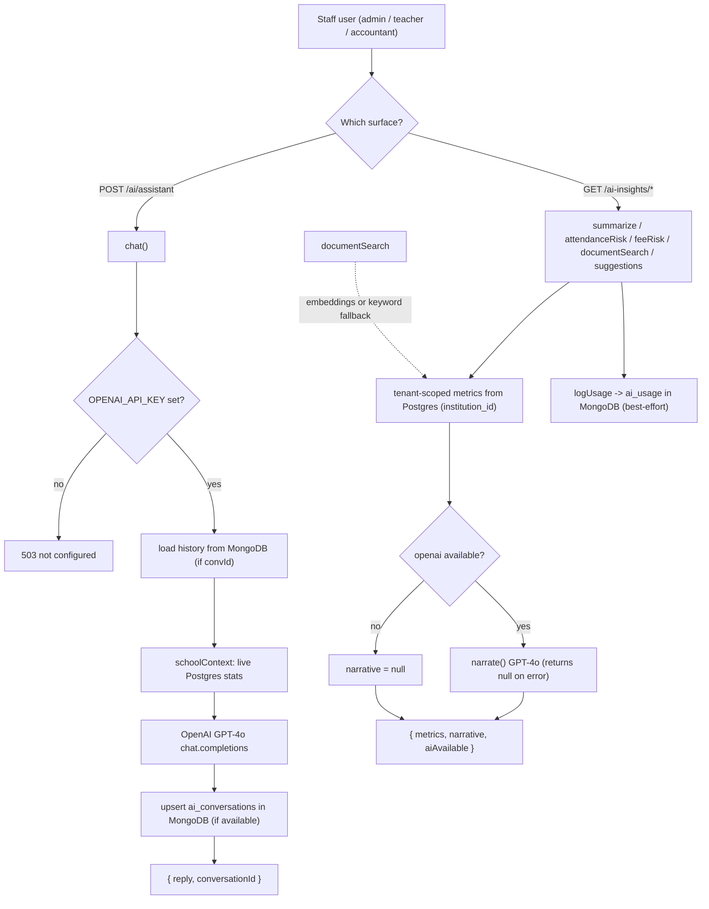

# AI Insights Pipeline — Pipeline Diagram

> Related: [Docs index](../README.md) · [Architecture](../ARCHITECTURE.md) · [Module workflows](../MODULE_WORKFLOWS.md) · `backend/src/modules/ai/` · `backend/src/modules/aiinsights/` · **Last updated:** 2026-06-23

## Overview
Two complementary surfaces: the conversational assistant (`ai` module) and the insights/analytics surface (`aiinsights` module). The assistant gathers a live tenant snapshot, calls OpenAI GPT-4o, and persists the conversation in MongoDB (when available). Insights compute deterministic metrics from Postgres (attendance-risk, fee-risk, KPI summaries, workflow suggestions, document search) and optionally wrap them in a GPT-4o narrative. Everything degrades gracefully: with no `OPENAI_API_KEY` the assistant returns 503 and insights still return raw metrics with a null narrative; with no Mongo, history/usage logging silently no-ops.

## Diagram

## Key files involved
- `backend/src/modules/ai/ai.service.ts` — `schoolContext`, `chat`, `listConversations`, `getConversation` (OpenAI client guarded by `OPENAI_API_KEY`; Mongo `ai_conversations`).
- `backend/src/modules/ai/ai.routes.ts` — staff-only (`authorize("admin","teacher","accountant")`).
- `backend/src/modules/aiinsights/aiinsights.service.ts` — `summarize`, `attendanceRisk`, `feeRisk`, `documentSearch` (semantic embeddings → keyword fallback), `workflowSuggestions`, `insightsDashboard`, `narrate`, `logUsage`, `aiAvailable`.
- `backend/src/modules/aiinsights/aiinsights.routes.ts` — `ai:*` permission gates.
- `backend/src/db/mongo.ts` — `getMongoDb` (null when Mongo unconfigured).
- `backend/src/config/env.ts` — `openaiApiKey`, `openaiModel`.

## Key APIs involved
- `POST /api/v1/ai/assistant` — ask GPT-4o (returns 503 when unconfigured).
- `GET /api/v1/ai/conversations` · `GET /api/v1/ai/conversations/{id}`.
- `GET /api/v1/ai-insights/dashboard` (`ai:read`).
- `GET /api/v1/ai-insights/summary/{report}` (`ai:summarize`).
- `GET /api/v1/ai-insights/risk/attendance` · `GET /api/v1/ai-insights/risk/fees` (`ai:risk_alerts`).
- `GET /api/v1/ai-insights/search` (`ai:document_search`) · `GET /api/v1/ai-insights/suggestions` (`ai:workflow_suggestions`).

## Operational notes
- Graceful degradation: assistant requires `OPENAI_API_KEY` (503 otherwise). Insights always return real metrics; `narrate()` returns null on missing key or any OpenAI error so a failed LLM call never breaks the response. `logUsage`/conversation history no-op when Mongo is unset.
- Security/tenancy: insights queries are parameterized and scoped by `institution_id`; conversations and usage are scoped by `userId`. Document search uses only metadata (names/category/owner), never file contents or storage keys; embeddings cover the latest 200 docs in the tenant.
- Privacy: the assistant injects aggregate live stats (counts, attendance, fee totals) as system context — no PII rows are sent; insight narratives are instructed not to invent names.
- Cost/performance: GPT-4o calls are bounded (`max_tokens` ~400-1000) and history is truncated to the last 20 messages; document-search embeds query + candidates per request. Reminders/actions are advisory — insights never auto-send (e.g. fee reminders require an explicit manual trigger).
