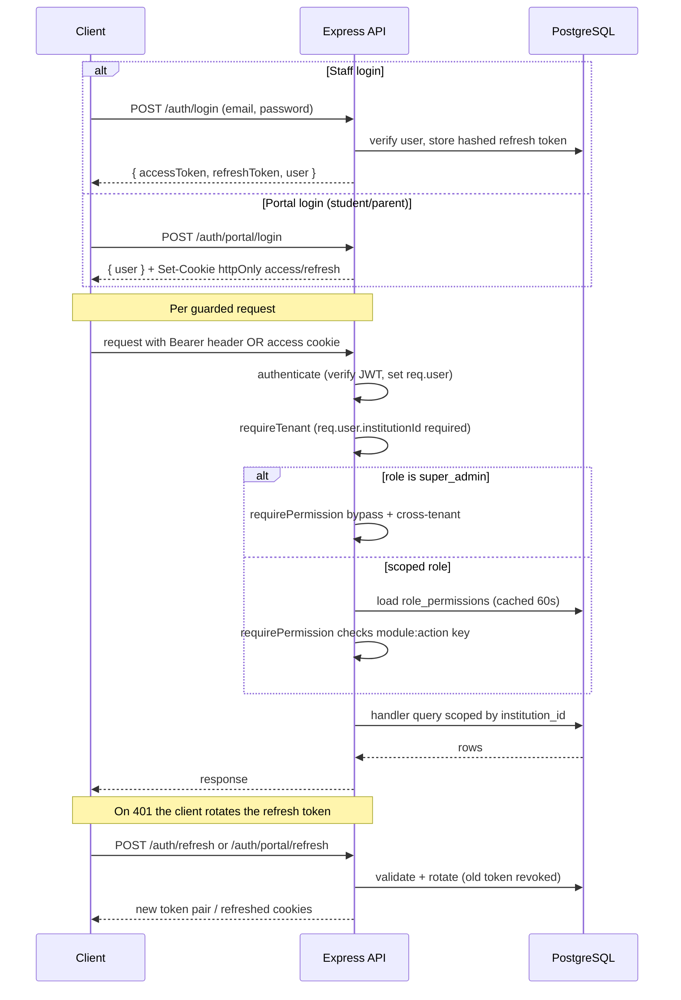

# Auth, RBAC and Tenant Flow — Pipeline Diagram

> Related: [Docs index](../README.md) · [ROLES_AND_PERMISSIONS.md](../ROLES_AND_PERMISSIONS.md) · [ARCHITECTURE.md](../ARCHITECTURE.md) · **Last updated:** 2026-06-23

## Overview
Staff authenticate with a JWT Bearer flow (`/auth/login` returns an access + refresh pair); students and parents use a portal flow (`/auth/portal/login`) that sets httpOnly cookies instead. Refresh tokens are SHA-256-hashed, stored in `refresh_tokens`, and rotated on every use. On each guarded request the pipeline runs `authenticate` → `requireTenant` → `requirePermission('module:action')`, where permissions are resolved from `role_permissions` joined to `permissions` and cached in-process for 60s. super_admin bypasses both the permission check and tenant scoping (it operates above any single school).

## Diagram

## Key files involved
- `backend/src/modules/auth/auth.routes.ts`, `auth.service.ts`, `auth.schema.ts`
- `backend/src/middleware/auth.ts` (`authenticate`, `authorize`)
- `backend/src/middleware/permissions.ts` (`requirePermission`, cached `loadRolePermissions`)
- `backend/src/middleware/tenant.ts` (`requireTenant`, `tenantId`)
- `backend/src/utils/jwt.ts`, `backend/src/utils/cookies.ts`
- `frontend/src/lib/api.ts`, `frontend/src/lib/portal-api.ts`
- `frontend/src/stores/auth-store.ts`

## Key APIs involved
- `POST /api/v1/auth/login`, `POST /api/v1/auth/refresh`, `POST /api/v1/auth/logout`
- `POST /api/v1/auth/portal/login`, `POST /api/v1/auth/portal/refresh`, `POST /api/v1/auth/portal/logout`
- `GET /api/v1/auth/me`, `GET /api/v1/auth/permissions`
- `POST /api/v1/auth/change-password` (revokes all sessions)

## Operational notes
- Tokens: access JWT carries `userId`, `role`, `institutionId`; refresh tokens are hashed at rest and rotated on use, so a stolen refresh token is single-use.
- `requireTenant` rejects super_admin (institutionId null) on school-scoped routes — super_admin uses the platform / super-admin console instead.
- The permission cache has a 60s TTL; call `invalidatePermissionCache()` after editing grants to avoid stale authorization.
- Portal cookies are `HttpOnly; Secure; SameSite=Lax` in production; `trust proxy` is set so `secure` works behind nginx. Staff accounts are rejected from the portal flow (403).
- Auth routes are rate-limited (`AUTH_RATE_LIMIT_MAX`, default 10 failed logins per window → 429).
