# Backup & Restore Pipeline — Pipeline Diagram

> Related: [Docs index](../README.md) · [Deployment §8](../DEPLOYMENT.md) · [Module workflows](../MODULE_WORKFLOWS.md) · `backend/src/modules/backups/` · **Last updated:** 2026-06-23

## Overview
Backups are super-admin only. The in-process worker tick checks the backup schedule and, when due, enqueues a deduped `scheduled_backup` job; the worker then builds a consistent logical snapshot (gzipped JSON) inside one `REPEATABLE READ` transaction, stores it (object storage or local fallback), writes a `backups` row, and prunes old backups per retention. Restore is destructive and guarded: a non-destructive preview, then explicit `confirm` (and `force` in production), running in a single transaction with `session_replication_role = replica`; every attempt is audited to `platform_audit_log`. See `DEPLOYMENT.md §8`.

## Diagram

```mermaid
flowchart TD
  subgraph Backup
    TICK["Worker tick"] --> EDS["enqueueDueScheduledBackups"]
    EDS --> DUE{"schedule enabled + next_run_at <= now?"}
    DUE -->|no| NOOP["no-op"]
    DUE -->|yes| ENQ["enqueue scheduled_backup (dedupeKey = backup:next_run_at)"]
    ENQ --> ADV["advance next_run_at (computeNextBackupRun)"]
    MAN["POST /api/v1/backups (manual)"] --> PB
    TICK2["runScheduledBackup (job handler)"] --> PB["performBackup"]
    ENQ --> Q["jobs queue"] --> TICK2
    PB --> BD["buildDump: REPEATABLE READ snapshot -> gzip JSON"]
    BD --> ST["storage.put(backups/{id}.json.gz)"]
    ST --> ROW["UPDATE backups: success, size, table/row count, schema_version"]
    ROW --> RET["applyRetention: keep latest N, delete older"]
    ROW --> AUD1["platform_audit_log: backup.create"]
  end

  subgraph Restore
    PV["GET /backups/{id}/restore/preview"] --> LP["loadDump + schema check"]
    LP --> PVO["restorable? schemaMatches? (non-destructive)"]
    RS["POST /backups/{id}/restore confirm + force"] --> GUARD{"global + confirm + (force if prod)?"}
    GUARD -->|no| ERR400["400 guard failed"]
    GUARD -->|yes| AUD2["audit restore.start"]
    AUD2 --> TX["withTransaction"]
    TX --> SRR["SET LOCAL session_replication_role = replica"]
    SRR --> TRUNC["TRUNCATE app tables RESTART IDENTITY CASCADE"]
    TRUNC --> LOAD["json_populate_recordset INSERT + setval sequences"]
    LOAD --> OK{"commit ok?"}
    OK -->|yes| AUD3["audit restore.success"]
    OK -->|no| RB["rollback -> audit restore.failed"]
  end
```

## Key files involved
- `backend/src/modules/backups/backups.service.ts` — `buildDump`, `performBackup`, `applyRetention`, `restorePreview`, `restoreBackup`, `enqueueDueScheduledBackups`, `runScheduledBackup`, `computeNextBackupRun`, `recordAudit` (uses `PUBLIC_SELECT` which omits `storage_key`).
- `backend/src/modules/backups/backups.routes.ts` — super-admin routes + `@openapi` blocks.
- `backend/src/modules/jobs/jobs.worker.ts` — `scheduled_backup` handler; tick calls `enqueueDueScheduledBackups` then drains the queue.
- `backend/src/utils/storage.ts` — `storage.put/get/remove`, `storageMode`.
- `backend/src/db/postgres.ts` — `withTransaction`.

## Key APIs involved
- `POST /api/v1/backups` — manual backup (`scope: global|institution`).
- `GET /api/v1/backups` · `GET /api/v1/backups/{id}` — list/get (no `storage_key` exposed).
- `GET /api/v1/backups/{id}/download` — audited artifact download.
- `GET /api/v1/backups/{id}/restore/preview` — non-destructive preview (`restorable`, `schemaMatches`).
- `POST /api/v1/backups/{id}/restore` — destructive restore (`confirm`, `force`).
- `GET/PATCH /api/v1/backups/settings` — retention + schedule.

## Operational notes
- Security: `backup:*` super-admin only. The API projection never returns `storage_key`; downloads and every backup/restore action are written to `platform_audit_log`.
- Restore guards: only `global` backups are restorable; `confirm: true` always required; `force: true` required when `NODE_ENV=production`; schema version must equal the current migration count or it aborts. The whole restore runs in one transaction and rolls back on any error.
- Privileges: `SET LOCAL session_replication_role = replica` (to bypass FK checks/triggers) needs a superuser-equivalent DB role — the Compose `POSTGRES_USER` qualifies; on managed Postgres use `rds_superuser` or equivalent.
- Idempotency: scheduled backups dedupe on `dedupeKey = backup:<next_run_at ISO>` so an overlapping/missed tick never double-runs; `next_run_at` advances after enqueue.
- Durability/retention: without `STORAGE_*` artifacts land on the local volume (lost if removed). Retention keeps the latest N successful backups per scope; `retention_count = NULL` disables pruning (nothing is deleted).
- Consistency/performance: snapshots are captured at `REPEATABLE READ` for a point-in-time view and gzipped; large databases produce large in-memory JSON, so run automated backups off-peak via the schedule.
