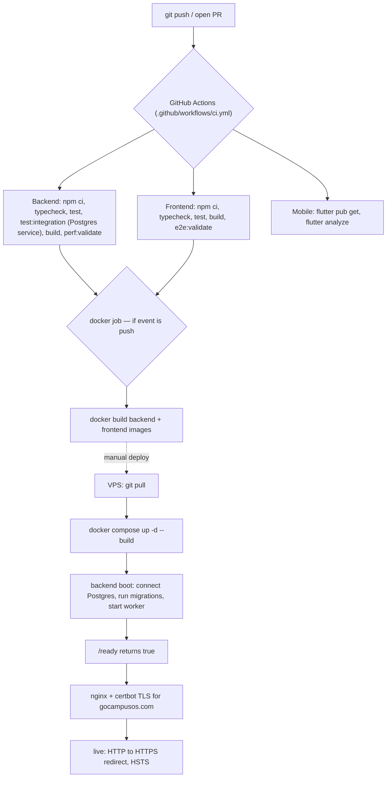

# Deployment Pipeline — Pipeline Diagram

> Related: [Docs index](../README.md) · [DEPLOYMENT.md](../DEPLOYMENT.md) · [ARCHITECTURE.md](../ARCHITECTURE.md) · **Last updated:** 2026-06-23

## Overview
A push to `main` (or any PR) triggers GitHub Actions: parallel Backend, Frontend and Mobile jobs gate the change, and a Docker job builds images only on push once backend + frontend pass. Deployment is manual on a VPS: pull the code and run `docker compose up -d --build`. The backend container auto-applies Postgres migrations on boot and runs the in-process worker; nginx serves traffic with Let's Encrypt / certbot TLS for gocampusos.com.

## Diagram

## Key files involved
- `.github/workflows/ci.yml` (backend / frontend / mobile / docker jobs)
- `docker-compose.yml` (production-oriented; auto-migrate + worker defaults)
- `backend/Dockerfile`, `frontend/Dockerfile`
- `backend/src/server.ts` (migrate-on-boot, listen)
- `backend/src/db/migrate.ts` (numbered-migration runner)
- `infra/nginx/production.conf.example` (TLS, HSTS, proxy)
- `docs/DEPLOYMENT.md` (full go-live runbook)
- `.env.production.example` (secrets template)

## Key APIs involved
- `GET /health` (`{"status":"ok","postgres":true,...}`)
- `GET /ready` (503 until DB + migrations + jobQueue ready)
- `GET /live`
- `GET /api/docs.json` (must be 404 in production)

## Operational notes
- CI gate: the docker image build runs only on `push` and `needs: [backend, frontend]`, so broken code never produces images.
- Integration tests run against a disposable Postgres service container; `JWT_*` secrets in CI must not start with `dev-` (the API refuses to boot otherwise).
- Migrations are forward-only and apply automatically on boot — take a backup before risky upgrades; rollback = redeploy the previous tag and restore if the schema changed.
- TLS: certbot certs live in `/etc/letsencrypt`; renew via cron + `docker compose exec nginx nginx -s reload`.
- Keep `ENABLE_API_DOCS=false` and `SEED_ON_START=false` after first boot; keep the `pgdata` volume across updates.
