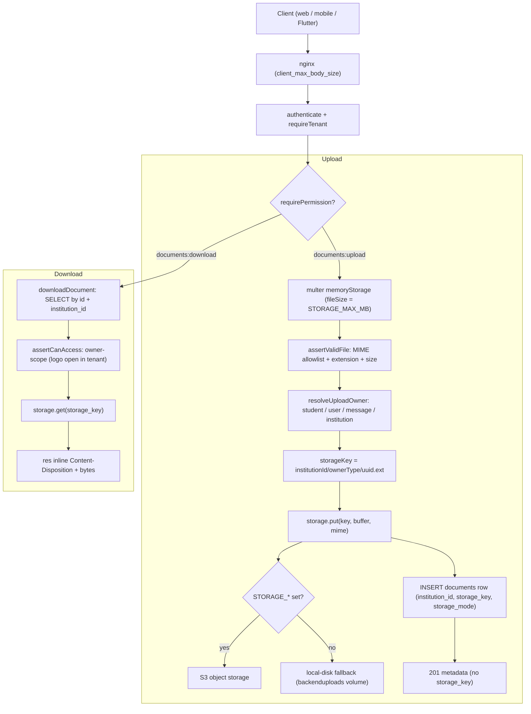

# Document Upload & Download Flow — Pipeline Diagram

> Related: [Docs index](../README.md) · [Module workflows](../MODULE_WORKFLOWS.md) · [Deployment](../DEPLOYMENT.md) · `backend/src/modules/documents/` · **Last updated:** 2026-06-23

## Overview
Documents (profile photos, ID cards, certificates, TCs, message attachments, institution logos) are uploaded as `multipart/form-data` through the `documents` module. The file bytes go to object storage (S3-compatible `STORAGE_*`) or, when unconfigured, to the local-disk fallback; only metadata is written to the `documents` table (carrying `institution_id`). Downloads always go through an authenticated, permission-checked, owner-scoped route — the raw `storage_key` is never returned to clients. The API size limit (`STORAGE_MAX_MB`) must stay aligned with nginx `client_max_body_size`.

## Diagram

## Key files involved
- `backend/src/modules/documents/documents.routes.ts` — multer wiring, size-limit mapping, `@openapi` blocks, `single("file")`.
- `backend/src/modules/documents/documents.service.ts` — `assertValidFile`, `resolveUploadOwner`, `createDocument`, `downloadDocument`, `assertCanAccess`, `deleteDocument`.
- `backend/src/modules/documents/documents.schema.ts` — `uploadFieldsSchema`, `listQuerySchema`.
- `backend/src/utils/storage.ts` — `storage.put/get/remove`, `storage.mode` (S3 vs local).
- `backend/src/utils/scope.ts` — `accessibleStudentIds`, `isStaff` (owner-scoping).
- `backend/src/config/env.ts` — `storageMaxMb` and `STORAGE_*`.
- `infra/nginx/production.conf` — `client_max_body_size`.

## Key APIs involved
- `POST /api/v1/documents` — upload (field `file`; `ownerType`, optional `ownerId`, `category`).
- `POST /api/v1/documents/logo` — upload/replace institution logo (`institution:logo:update`).
- `GET /api/v1/documents` — list metadata (owner-scoped; no storage paths).
- `GET /api/v1/documents/{id}/download` — protected, owner-scoped download.
- `DELETE /api/v1/documents/{id}` — delete row + stored file.

## Operational notes
- Security: defense-in-depth on type — MIME allowlist (`image/*`, `application/pdf`) plus a dangerous-extension denylist plus extension/content-type matching. Storage keys (`institutionId/ownerType/uuid.ext`) never leave the server; download filenames are sanitized.
- Tenancy: every query is filtered by `institution_id`; uploads validate the owner reference belongs to the tenant. Student/parent callers are limited to their own/linked documents (plus the tenant logo) on both list and download.
- Failure modes: `storage.put`/`storage.get` failures surface as `503 service unavailable` (not a 500 leak). Oversized uploads are rejected twice — multer (`LIMIT_FILE_SIZE` → 400) and `assertValidFile` (400) — so keep `STORAGE_MAX_MB` and nginx `client_max_body_size` in sync to avoid a confusing 413 at the proxy.
- Durability: without `STORAGE_*` files live on the `backenduploads` Docker volume and are lost if the volume is removed; configure object storage in production.
- Idempotency: each upload writes a fresh UUID key, so retries create distinct objects; delete removes both the artifact and the row.
