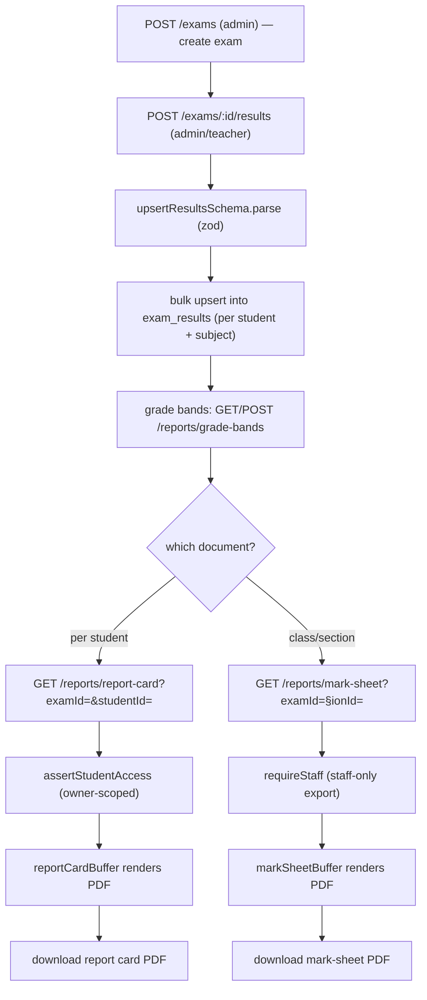

# Exam and Report Card Pipeline — Pipeline Diagram

> Related: [Docs index](../README.md) · [MODULE_WORKFLOWS.md](../MODULE_WORKFLOWS.md) · [DATABASE_SCHEMA.md](../DATABASE_SCHEMA.md) · **Last updated:** 2026-06-23

## Overview
An admin creates an exam; teachers/admins enter per-subject results in a single bulk upsert call. The institution maintains a grade scale (grade bands mapping percentage ranges to grades and remarks). From the stored results plus the grade bands, the reports module renders a per-student report card PDF (owner-scoped) or a class/section mark-sheet PDF (staff only).

## Diagram

## Key files involved
- `backend/src/modules/exams/exams.routes.ts`, `exams.service.ts` (`createExam`, `upsertResults`, `examResults`, `studentReport`)
- `backend/src/modules/exams/exams.schema.ts` (`createExamSchema`, `upsertResultsSchema`)
- `backend/src/modules/reports/reports.routes.ts`, `reports.service.ts` (grade bands, `reportCardBuffer`, `markSheetBuffer`)
- `backend/src/modules/reports/reports.pdf.ts` (PDF rendering)
- `backend/src/modules/reports/reports.schema.ts`
- `backend/src/utils/scope.ts` (`assertStudentAccess`, `requireStaff`)
- `frontend/src/app/(dashboard)/exams/page.tsx`, `frontend/src/app/portal/reports/page.tsx`

## Key APIs involved
- `GET /api/v1/exams`, `POST /api/v1/exams` (admin)
- `GET /api/v1/exams/{id}/results` (staff), `POST /api/v1/exams/{id}/results` (admin/teacher bulk upsert)
- `GET /api/v1/exams/students/{studentId}/report`
- `GET/POST/PATCH/DELETE /api/v1/reports/grade-bands`
- `GET /api/v1/reports/report-card` (owner-scoped), `GET /api/v1/reports/mark-sheet` (staff)

## Operational notes
- Results entry is a single bulk upsert: re-posting the same `(studentId, subjectId)` updates marks rather than duplicating, so teachers can correct entries idempotently.
- Report card access is owner-scoped — staff see any student, a student only their own, a parent only linked children (`report_cards:read` + `assertStudentAccess`). Mark-sheet export is staff-only (`requireStaff`, `mark_sheets:export`).
- Grade bands are per-institution reference data; report cards resolve grades from them at render time, so editing a band changes future renders without touching stored marks.
- All exam/result/report queries are tenant-scoped by `institution_id`.
