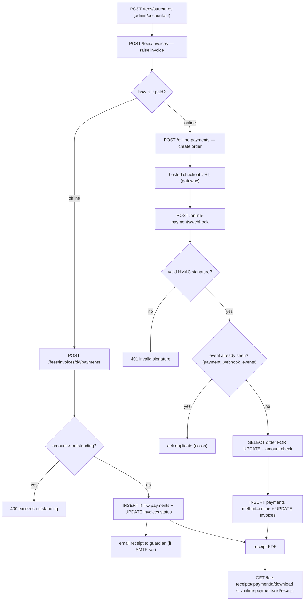

# Fee, Payment and Receipt Pipeline — Pipeline Diagram

> Related: [Docs index](../README.md) · [MODULE_WORKFLOWS.md](../MODULE_WORKFLOWS.md) · [DATABASE_SCHEMA.md](../DATABASE_SCHEMA.md) · **Last updated:** 2026-06-23

## Overview
Staff define a fee structure, raise an invoice against a student, and either record an offline payment or let a parent pay online. Offline payments enforce an overpay guard (`amount > outstanding` → 400) and flip the invoice to `partially_paid` / `paid`. Online payments create an order with a hosted-checkout URL; the gateway later calls a signature-verified, idempotent webhook that credits the invoice using the same ledger rules and writes a `payments` row with method `online`. Successful payments yield a downloadable receipt PDF.

## Diagram

## Key files involved
- `backend/src/modules/fees/fees.routes.ts`, `fees.service.ts` (`recordPayment` overpay guard)
- `backend/src/modules/fees/feedepth.service.ts` (schedules, fines, discounts, breakdown)
- `backend/src/modules/onlinepayments/onlinepayments.routes.ts`, `onlinepayments.service.ts` (`createOrder`, `processWebhook`)
- `backend/src/modules/onlinepayments/gateway.ts` (`verifySignature`, `parseEvent`)
- `backend/src/modules/pdfs/pdfs.routes.ts`, `pdfs.service.ts` (`feeReceiptBuffer`)
- Tables: `fee_structures`, `invoices`, `payments`, `payment_orders`, `payment_webhook_events`

## Key APIs involved
- `GET/POST /api/v1/fees/structures`, `GET/POST /api/v1/fees/invoices`
- `GET /api/v1/fees/invoices/{id}`, `POST /api/v1/fees/invoices/{id}/payments`
- `POST /api/v1/online-payments` (create order), `GET /api/v1/online-payments/{id}`
- `POST /api/v1/online-payments/webhook` (public, signature-verified)
- `POST /api/v1/online-payments/{id}/refund`, `GET /api/v1/online-payments/{id}/receipt`
- `GET /api/v1/fee-receipts/{paymentId}/download`

## Operational notes
- Overpay guard: `recordPayment` rejects `amount > outstanding` (400). The webhook path credits only `min(order.amount, outstanding)` so a duplicate/overlapping credit can never overpay.
- Idempotency: the webhook inserts into `payment_webhook_events` with `ON CONFLICT (provider, event_id) DO NOTHING`; a duplicate event is acked as a no-op. The order row is `SELECT ... FOR UPDATE` locked and a success state is never downgraded.
- Security: the webhook is unauthenticated by necessity (the gateway calls it) but HMAC-verifies the raw body; it returns 503 when the gateway is unconfigured. A defense-in-depth amount check compares webhook amount to the server-set order amount.
- Tenancy: a webhook touches only the single order's `institution_id`; no cross-tenant read/write. Online payments are also feature-flagged per institution (`online_payments:settings`).
- Receipt download is owner-scoped (`fee_receipts:download` + `assertStudentAccess`) and only valid after a payment succeeds.
