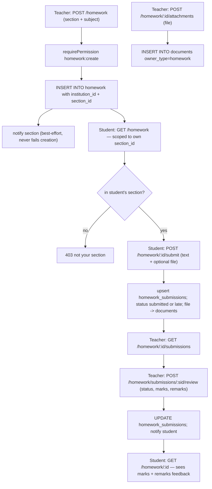

# Homework Assignment Flow — Pipeline Diagram

> Related: [Docs index](../README.md) · [MODULE_WORKFLOWS.md](../MODULE_WORKFLOWS.md) · [DATABASE_SCHEMA.md](../DATABASE_SCHEMA.md) · **Last updated:** 2026-06-23

## Overview
A teacher creates homework for a section + subject (with optional file attachments) and the section is notified. Students in that section see the assignment (owner-scoped to their section) and submit text and/or a file; submissions are upserted so a student can resubmit. The teacher lists submissions and reviews/grades each one, and the student then sees the marks, status and remarks. Files live in the `documents` table; assignments and submissions live in `homework` and `homework_submissions`.

## Diagram

## Key files involved
- `backend/src/modules/homework/homework.routes.ts`, `homework.service.ts`, `homework.schema.ts`
- `backend/src/modules/documents/documents.service.ts` (`assertValidFile`, attachment storage)
- `backend/src/utils/upload.ts` (`uploadSingle`)
- `backend/src/utils/scope.ts` (section-based owner scoping)
- `frontend/src/app/(dashboard)/homework/page.tsx`, `frontend/src/app/portal/homework/page.tsx`
- Tables: `homework`, `homework_submissions`, `documents`

## Key APIs involved
- `GET /api/v1/homework`, `POST /api/v1/homework` (teacher)
- `GET /api/v1/homework/{id}`, `PATCH /api/v1/homework/{id}`, `DELETE /api/v1/homework/{id}`
- `POST /api/v1/homework/{id}/attachments` (multipart `file`)
- `POST /api/v1/homework/{id}/submit` (student; text + optional file)
- `GET /api/v1/homework/{id}/submissions` (teacher)
- `POST /api/v1/homework/submissions/{sid}/review` (teacher grade/feedback)
- `GET /api/v1/homework/attachments/{docId}/download` (owner-scoped)

## Operational notes
- Section scoping: students/parents only list homework for their own `section_id` (resolved from their student record); a submit to a homework outside the section is rejected with 403.
- Submissions are upserts (`ON CONFLICT DO UPDATE`) keyed per student + homework, so resubmission overwrites rather than duplicating; status is set to `late` automatically when past the due date.
- Notifications on create and on submit/review are best-effort and wrapped in `.catch(...)` — a notify failure never fails the underlying mutation.
- Attachments are stored as `documents` rows (`owner_type='homework'`) via the upload util; downloads are permission-guarded (`homework:read`) and owner-scoped, never exposing storage keys.
- Every query is tenant-scoped by `institution_id`; permissions are `homework:create|read|update|delete|submit|review`.
