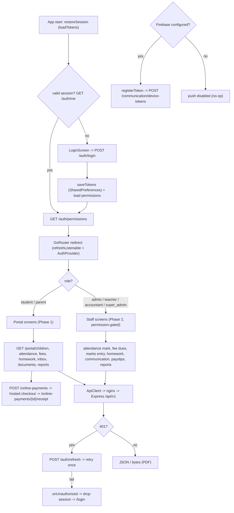

# Mobile App API Flow — Pipeline Diagram

> Related: [Docs index](../README.md) · [Architecture](../ARCHITECTURE.md) · [Roles & permissions](../ROLES_AND_PERMISSIONS.md) · `mobile/lib/` · **Last updated:** 2026-06-23

## Overview
The Flutter app talks to the same `/api/v1` backend as the web client, using JWT Bearer auth with persisted access/refresh tokens and automatic refresh-and-retry on 401. GoRouter gates navigation on auth state; staff vs portal (student/parent) surfaces are chosen by role, and staff tiles are further gated by the caller's permission set. Screens call owner-scoped endpoints (attendance, fees + online payment, homework, communication, payslips, reports). FCM push is optional — the app runs fully without Firebase and registers a device token only when available. The API base URL is injected at build time via `--dart-define=API_URL`.

## Diagram

## Key files involved
- `mobile/lib/core/api_client.dart` — `ApiClient`, `baseUrl` from `--dart-define=API_URL`, Bearer header, refresh-and-retry, `getBytes` (PDF), `postMultipart`, `onUnauthorized`.
- `mobile/lib/providers/auth_provider.dart` — login/logout, `restoreSession`, `_loadPermissions`, role helpers (`isPortal`, `isStaff`, `can`).
- `mobile/lib/app.dart` — `GoRouter` with auth redirect and `refreshListenable`.
- `mobile/lib/providers/portal_provider.dart` — `/portal/children`, selected child shared across portal tabs.
- `mobile/lib/services/notification_service.dart` — FCM init + `registerToken` (optional).
- `mobile/lib/screens/portal/` (attendance, fees, homework, inbox, documents, reports, payment_result) and `mobile/lib/screens/staff/` (attendance_mark, fee_dues, marks_entry, homework, communication, payslips, reports).

## Key APIs involved
- `POST /api/v1/auth/login` · `POST /api/v1/auth/refresh` · `POST /api/v1/auth/logout` · `GET /api/v1/auth/me` · `GET /api/v1/auth/permissions`.
- Portal: `GET /api/v1/portal/children` and child-scoped attendance/fees/homework/inbox/documents/reports.
- Payments: `POST /api/v1/online-payments` · `GET /api/v1/online-payments/{id}` · `GET /api/v1/online-payments/{id}/receipt`.
- Staff: attendance mark, fee dues, exam marks, homework, `POST /api/v1/communication/messages`, payslips, report-center.
- Push: `POST /api/v1/communication/device-tokens`.

## Operational notes
- Auth: staff use JWT Bearer (access + refresh persisted in SharedPreferences). On 401 the client refreshes once and retries; if refresh fails it clears tokens and `onUnauthorized` drives GoRouter back to `/login`. Login itself is exempt from the retry loop.
- Build config: `API_URL` is compile-time (`String.fromEnvironment`), defaulting to the Android-emulator loopback `http://10.0.2.2:4000/api/v1`; production builds pass the real HTTPS origin via `--dart-define=API_URL=...`.
- Authorization: portal screens hit owner-scoped endpoints (a parent only sees linked children); staff tiles are shown via `AuthProvider.can(permission)` — `super_admin` implicitly holds all. The same backend RBAC is the real enforcement; client gating is UX only.
- Optional push: FCM is best-effort — token registration is silently skipped when Firebase is unconfigured, so the app is fully usable without push.
- Files: PDFs (receipts, payslips, reports) are fetched as bytes through the same Bearer-authenticated client with refresh-and-retry.
