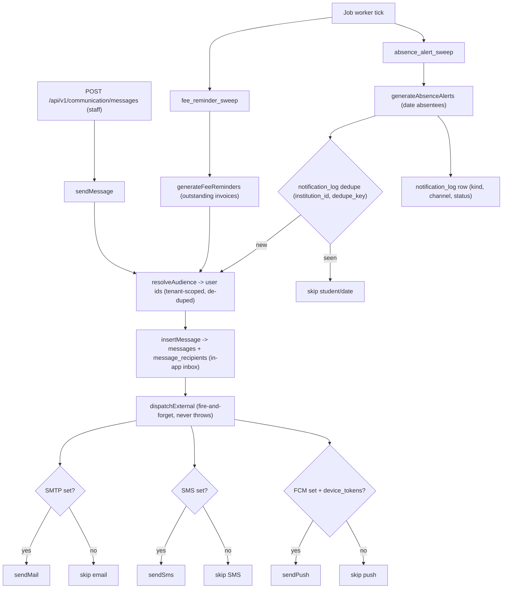

# Notification Pipeline — Pipeline Diagram

> Related: [Docs index](../README.md) · [Module workflows](../MODULE_WORKFLOWS.md) · [Deployment](../DEPLOYMENT.md) · `backend/src/modules/communication/` · **Last updated:** 2026-06-23

## Overview
Notifications originate either from a manual staff message (`POST /api/v1/communication/messages`) or from background sweeps (`fee_reminder_sweep`, `absence_alert_sweep`) run by the job worker. The audience is resolved to a de-duplicated set of tenant-scoped recipient user ids, an in-app message + per-recipient rows are written (the authoritative inbox), and external channels — email (SMTP), SMS, push (FCM) — are fanned out best-effort. Every channel degrades gracefully: when a transport is unconfigured its send is a silent no-op, and external delivery never blocks or fails the originating request.

## Diagram

## Key files involved
- `backend/src/modules/communication/communication.service.ts` — `resolveAudience`, `insertMessage`, `sendMessage`, `generateFeeReminders`, `generateAbsenceAlerts`, inbox/`unreadCount`/`markRead`, `registerDeviceToken`.
- `backend/src/modules/communication/communication.channels.ts` — `dispatchExternal` (best-effort email/SMS/push fan-out, `Promise.allSettled`).
- `backend/src/modules/communication/communication.templates.ts` — `feeReminderMessage`, `absenceAlertMessage`.
- `backend/src/utils/mailer.ts` / `backend/src/utils/sms.ts` / `backend/src/utils/fcm.ts` — channel senders (no-op when unconfigured).
- `backend/src/modules/jobs/jobs.worker.ts` — `fee_reminder_sweep` / `absence_alert_sweep` handlers.

## Key APIs involved
- `POST /api/v1/communication/messages` — send a message to an audience.
- `GET /api/v1/communication/inbox` · `GET /api/v1/communication/inbox/unread-count` · `POST /api/v1/communication/inbox/{id}/read`.
- `POST /api/v1/communication/device-tokens` — register an FCM token (caller registers their own).
- `POST /api/v1/jobs/process` — drains the queue (runs enqueued sweeps).

## Operational notes
- Graceful degradation: `dispatchExternal` is invoked fire-and-forget (`void`); a transport failure is caught and logged, never bubbling to the request. Each sender no-ops when its credentials are unset, so the in-app inbox always works even with no SMTP/SMS/FCM.
- Idempotency: absence alerts are de-duplicated per `(institution_id, dedupe_key = absence:<studentId>:<date>)` via `notification_log` unless `force` is set; `message_recipients` uses `ON CONFLICT (message_id, user_id) DO NOTHING`. Device-token upsert keys on `token`.
- Tenancy: audience resolution and all inserts are scoped by `institution_id`; the inbox is owner-scoped to the caller.
- Channels: in-app (`messages`/`message_recipients`) is the system of record; email/SMS/push are best-effort delivery layers. FCM only fires when matching `device_tokens` exist.
- Performance: sweeps iterate per student and call `dispatchExternal` per message; large tenants generate many rows — they run inside the worker (off the request path), driven by the queue.
