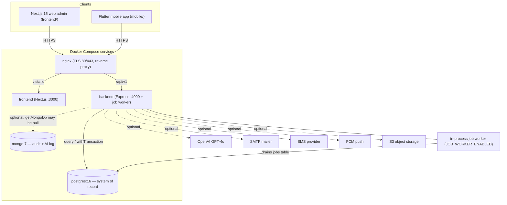

# Overall System Architecture — Pipeline Diagram

> Related: [Docs index](../README.md) · [ARCHITECTURE.md](../ARCHITECTURE.md) · [DEPLOYMENT.md](../DEPLOYMENT.md) · **Last updated:** 2026-06-23

## Overview
GoCampus / SRE EDU OS is an API-first, multi-tenant school ERP. A Next.js 15 web admin and a Flutter mobile app both consume one Express 5 REST API (`/api/v1`) through an nginx reverse proxy that terminates TLS. The API is stateless: PostgreSQL 16 is the system of record (UUID PKs, `institution_id` row scoping) and MongoDB 7 holds optional audit logs and AI chat history. OpenAI, SMTP, SMS, FCM and S3-compatible storage are optional and degrade gracefully when unconfigured; an in-process job worker drains the Postgres `jobs` table. All of it ships as Docker Compose services.

## Diagram

## Key files involved
- `docker-compose.yml` (postgres, mongo, backend, frontend, nginx services)
- `infra/nginx/default.conf` and `infra/nginx/production.conf.example`
- `backend/src/app.ts` (middleware + `/api/v1` router mounting)
- `backend/src/server.ts` (migrate-on-boot, listen)
- `backend/src/db/postgres.ts` (`query()` / `withTransaction()`)
- `backend/src/db/mongo.ts` (`getMongoDb()` returns null when off)
- `backend/src/modules/jobs/jobs.worker.ts` (in-process worker)
- `backend/src/config/env.ts` (single source of truth for env vars)
- `frontend/src/lib/api.ts` (only HTTP entry point on web)
- `mobile/lib/core/` (`ApiClient` token persistence + refresh)

## Key APIs involved
- `GET /health`, `GET /ready`, `GET /live` (public probes)
- `GET /api/docs` (Swagger, off in production)
- `GET /api/v1/observability/metrics` (Prometheus text, super-admin)
- All domain routes under `/api/v1/*`

## Operational notes
- Stateless API: no server session state, so any backend instance can serve any request — scale horizontally behind nginx.
- No Redis: caching (permissions, dashboard) is in-process; the job queue is the Postgres `jobs` table, not a broker.
- Optional dependencies fail soft: missing OpenAI → 503 only on AI routes; missing Mongo → audit/AI history skipped; missing S3 → local `backenduploads` volume fallback.
- Tenancy: every domain table carries `institution_id`; services filter every query by it. super_admin operates above tenants.
- Migrations auto-run on backend boot; `/ready` returns 503 until DB + migrations are ready.
