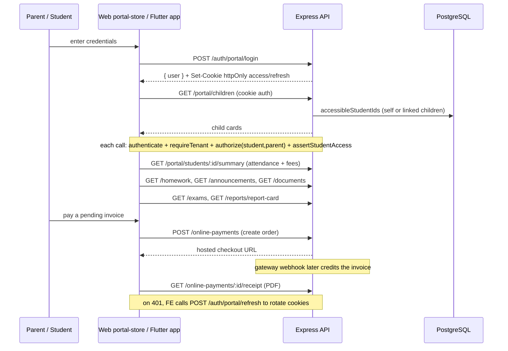

# Parent / Student Portal Flow — Pipeline Diagram

> Related: [Docs index](../README.md) · [MODULE_WORKFLOWS.md](../MODULE_WORKFLOWS.md) · [ROLES_AND_PERMISSIONS.md](../ROLES_AND_PERMISSIONS.md) · **Last updated:** 2026-06-23

## Overview
Students and parents sign in through the portal flow, which sets httpOnly cookies (`/auth/portal/login`) so tokens are never JS-readable. Every portal request is owner-scoped: a student sees only themselves, a parent only their linked children, enforced by `accessibleStudentIds` + `assertStudentAccess`. From the portal they view attendance, fees, exams/report cards, homework, announcements and documents, pay fees online, and download receipts and report-card PDFs. The same contract backs both the Next.js web portal and the Flutter portal screens.

## Diagram

## Key files involved
- `backend/src/modules/portal/portal.routes.ts`, `portal.service.ts`
- `backend/src/modules/auth/auth.routes.ts` (`/auth/portal/*`), `backend/src/utils/cookies.ts`
- `backend/src/utils/scope.ts` (`accessibleStudentIds`, `assertStudentAccess`)
- `frontend/src/stores/portal-store.ts`, `frontend/src/lib/portal-api.ts`
- `frontend/src/app/portal/` (login, fees, homework, payment, reports, attendance, announcements, documents pages)
- `mobile/lib/screens/portal/`

## Key APIs involved
- `POST /api/v1/auth/portal/login`, `POST /api/v1/auth/portal/refresh`, `POST /api/v1/auth/portal/logout`
- `GET /api/v1/portal/children`, `GET /api/v1/portal/students/{studentId}/summary`
- `GET /api/v1/portal/students/{studentId}/timetable`, `.../disciplinary`
- `GET /api/v1/homework`, `GET /api/v1/exams`, `GET /api/v1/fees/invoices/{id}/breakdown`
- `POST /api/v1/online-payments`, `GET /api/v1/online-payments/{id}/receipt`
- `GET /api/v1/reports/report-card`, `GET /api/v1/fee-receipts/{paymentId}/download`

## Operational notes
- Sessions live in httpOnly + Secure + SameSite=Lax cookies (production); the portal client never reads tokens and relies on `credentials: include` for refresh.
- The portal router is locked to `authorize("student","parent")` after `authenticate` + `requireTenant`; staff cannot enter the portal.
- Owner-scoping is defense-in-depth: list endpoints filter by `accessibleStudentIds` and single-record endpoints call `assertStudentAccess` (403 otherwise), so a parent cannot read another family's child.
- Disciplinary records appear only when the institution enables portal visibility (`disciplinary:portal_read`).
- Online payment from the portal reuses the shared create-order → webhook → receipt pipeline; the portal only ever creates an order, never records a payment directly.
