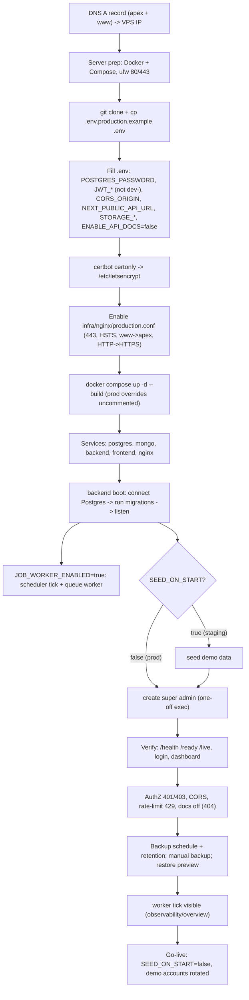

# Production Go-Live Flow — Pipeline Diagram

> Related: [Docs index](../README.md) · [Deployment runbook](../DEPLOYMENT.md) · `docker-compose.yml` · `infra/nginx/production.conf` · **Last updated:** 2026-06-23

## Overview
End-to-end runbook to bring GoCampus live on a VPS with Docker Compose + nginx + TLS (the gocampusos.com live setup). Point DNS at the box, configure `.env` (secrets, `CORS_ORIGIN`, `NEXT_PUBLIC_API_URL`, `SEED_ON_START`, `STORAGE_*`), issue a TLS cert with certbot, then bring the stack up; migrations and the background worker start automatically on backend boot. After first boot create the super admin, verify `/health` + login + dashboard + worker/backups, and confirm the `www → apex` and `HTTP → HTTPS` redirects. Full detail in `DEPLOYMENT.md`.

## Diagram

## Key files involved
- `DEPLOYMENT.md` — the authoritative runbook (§3 secrets, §4 first boot, §5 TLS, §6 verify, §7 worker, §8 backup/restore, §12 checklist).
- `docker-compose.yml` — services (postgres, mongo, backend, frontend, nginx); `JOB_WORKER_ENABLED` default true; nginx 443 + cert mounts present as comments to uncomment for prod.
- `infra/nginx/production.conf` (from `production.conf.example`) — TLS, HSTS, security headers, `HTTP → HTTPS` and `www → apex` redirects, `client_max_body_size`, `/api` → backend, `/` → frontend.
- `.env.production.example` — template for required + optional env vars.
- `backend/src/config/env.ts` — boot-time guards (refuses `dev-` JWT secrets in production).

## Key APIs involved
- `GET /health` · `GET /ready` · `GET /live` — probes (public, no secrets).
- `POST /api/v1/auth/login` — smoke-test sign-in.
- `GET /api/v1/observability/overview` · `GET /api/v1/observability/metrics` — worker + queue + counters (super-admin).
- `POST /api/v1/backups` · `GET /api/v1/backups/{id}/restore/preview` — backup + restore-preview drill.
- `GET /api/docs.json` — must return 404 in production (`ENABLE_API_DOCS=false`).

## Operational notes
- Secrets: `JWT_ACCESS_SECRET`/`JWT_REFRESH_SECRET` must be distinct and not start with `dev-` (the API refuses to boot otherwise); strong `POSTGRES_PASSWORD`; only `*.env.example` templates are committed.
- TLS/redirects: certbot issues the cert; nginx terminates TLS, sets HSTS + security headers, and redirects `HTTP → HTTPS` and `www → apex`. Renew via `certbot renew` + `nginx -s reload`.
- Migrations + worker: migrations are forward-only and auto-run on backend boot; `JOB_WORKER_ENABLED=true` (Compose default) runs the in-process scheduler/queue worker — confirm via `observability/overview`.
- First boot: use `SEED_ON_START=true` only for staging demo data; for production keep it `false` and create a super admin via the documented one-off exec, then rotate/disable any demo accounts.
- Verification gates (pre-go-live dry-run): unauthenticated `401`, cross-tenant/permission `403`, CORS restricted to `CORS_ORIGIN`, auth rate-limit `429`, API docs `404`, private downloads behind auth, portal cookies `HttpOnly; Secure; SameSite=Lax`, backup + restore-preview pass on a throwaway DB.
- Durability: configure `STORAGE_*` so uploads and backups survive; keep `STORAGE_MAX_MB` aligned with nginx `client_max_body_size`. Configure Docker log rotation; take a backup before risky upgrades and roll back code + restore if a schema change goes bad.
