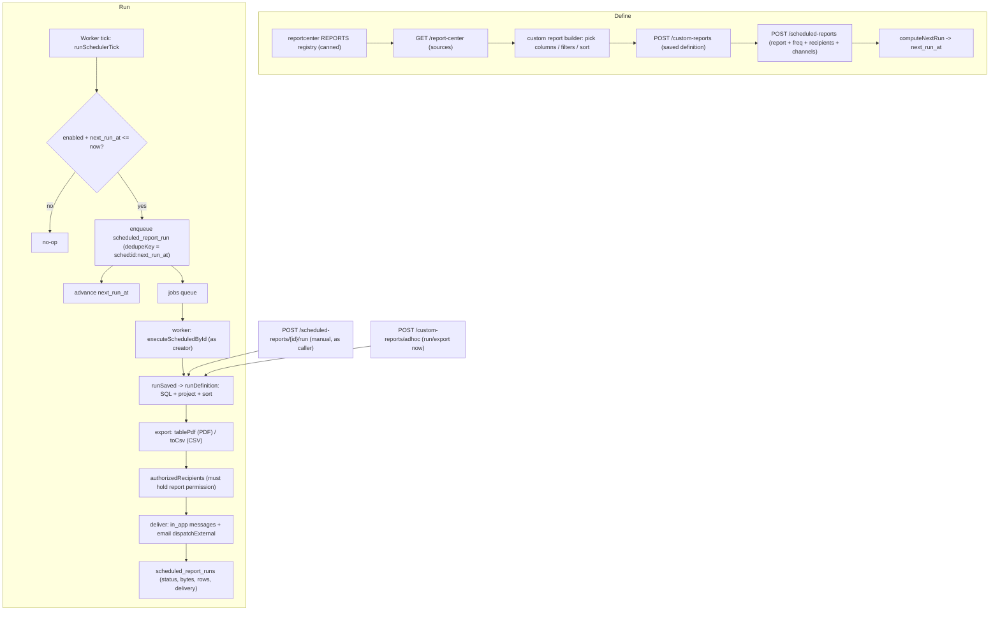

# Reports Center Pipeline — Pipeline Diagram

> Related: [Docs index](../README.md) · [Module workflows](../MODULE_WORKFLOWS.md) · [API reference](../API_REFERENCE.md) · `backend/src/modules/reportcenter/` · `backend/src/modules/customreports/` · `backend/src/modules/scheduledreports/` · **Last updated:** 2026-06-23

## Overview
The Reports Center has three layers: canned reports (a registry of permission-gated SQL reports in `reportcenter`), a custom report builder (saved column/filter/sort definitions over a canned source in `customreports`), and scheduling (`scheduledreports`). A schedule references a saved report; on each scheduler tick, due schedules are enqueued as `scheduled_report_run` jobs, and the worker generates the report (CSV / PDF), delivers it to authorized recipients via in-app inbox and/or email, and records a run in `scheduled_report_runs`. A custom or scheduled report never widens access — the underlying report's own permission is always re-checked.

## Diagram

## Key files involved
- `backend/src/modules/reportcenter/reportcenter.service.ts` — `REPORTS` registry, `getReport`, `listReports`, `toCsv`; `reportcenter.pdf.ts` — `tablePdf`.
- `backend/src/modules/reportcenter/reportcenter.routes.ts` — run/export with per-report `assertPerm`.
- `backend/src/modules/customreports/customreports.service.ts` — saved CRUD, `runSaved`, `adhocRun`, `assertUnderlyingPermission`, `runDefinition`.
- `backend/src/modules/scheduledreports/scheduledreports.service.ts` — `computeNextRun`, `createSchedule`, `execute`, `runNow`, `runDue`, `executeScheduledById`, `authorizedRecipients`, `deliver`.
- `backend/src/modules/jobs/jobs.service.ts` — `runSchedulerTick` (enqueues due schedules); `jobs.worker.ts` — `scheduled_report_run` handler.

## Key APIs involved
- `GET /api/v1/report-center` · `GET /api/v1/report-center/{key}` · `GET /api/v1/report-center/{key}/export` (canned).
- `GET/POST /api/v1/custom-reports` · `POST /api/v1/custom-reports/adhoc` · `GET .../{id}/run` · `GET .../{id}/export` (builder).
- `GET/POST /api/v1/scheduled-reports` · `PATCH/DELETE .../{id}` · `POST .../{id}/run` · `GET .../{id}/runs` · `POST /scheduled-reports/run-due`.
- `POST /api/v1/jobs/run-scheduler` · `POST /api/v1/jobs/process` (drive scheduling/queue manually).

## Operational notes
- Security: a report's permission (e.g. `reports:fees:read`, `reports:attendance:read`) is checked on every run, export, custom-report run, and schedule create. Scheduled runs execute as the schedule's creator; recipients are filtered to those who actually hold the underlying permission (no data leak), and a missing/invalid creator records a `skipped` run.
- Tenancy: all report SQL and `scheduled_report_runs` are scoped by `institution_id`; custom reports honor `private` vs `shared` visibility.
- Idempotency: scheduler tick dedupes via `dedupeKey = sched:<id>:<next_run_at ISO>`; advancing `next_run_at` is the tick's job, not the worker's, so a retried job won't re-advance the schedule.
- Reliability: `execute` always inserts a run row first and records `success`/`failed` with bytes + row + recipient counts; a failed generation is captured without crashing the worker. The worker retries the job with backoff up to `max_attempts`.
- Delivery: in-app is always written when `in_app` is a channel; email is best-effort via `dispatchExternal` (no-op without SMTP). Formats: `csv`, `pdf`, or `both`.
