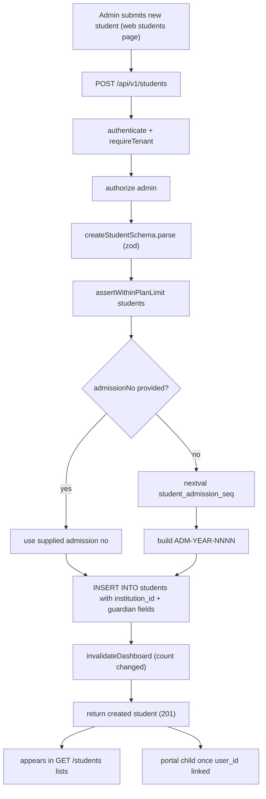

# Student Admission Pipeline — Pipeline Diagram

> Related: [Docs index](../README.md) · [MODULE_WORKFLOWS.md](../MODULE_WORKFLOWS.md) · [DATABASE_SCHEMA.md](../DATABASE_SCHEMA.md) · **Last updated:** 2026-06-23

## Overview
An admin enrolls a student via the students module. The request passes auth + tenant guards, the body is zod-validated, plan limits are checked, and an admission number is auto-assigned from an atomic Postgres sequence when not supplied. The student row is inserted under the caller's `institution_id` (with guardian fields), the dashboard cache is invalidated, and the new student immediately appears in staff lists and — once linked to a portal user — in the parent/student portal.

## Diagram

## Key files involved
- `backend/src/modules/students/students.routes.ts`
- `backend/src/modules/students/students.service.ts` (`createStudent`, `nextAdmissionNo`)
- `backend/src/modules/students/students.schema.ts`
- `backend/src/utils/plan-limits.ts` (`assertWithinPlanLimit`)
- `backend/src/utils/scope.ts` (`accessibleStudentIds`, `assertStudentAccess`)
- `backend/src/db/migrations/` (migration 0009 adds `student_admission_seq`)
- `frontend/src/app/(dashboard)/students/page.tsx` (reference form/table page)

## Key APIs involved
- `POST /api/v1/students` (enroll, admin only)
- `GET /api/v1/students` (paginated list, search + section/status filters)
- `GET /api/v1/students/{id}`
- `PATCH /api/v1/students/{id}`, `DELETE /api/v1/students/{id}` (soft archive; `hard=true` permanent)

## Operational notes
- Admission numbers use an atomic `nextval('student_admission_seq')` (migration 0009) — race-free, unlike the old `count(*)+1`. Format is `ADM-<year>-<4-digit>`; a unique constraint on `(institution_id, admission_no)` rejects collisions when supplied manually.
- Tenancy: every insert and read is scoped by `institution_id` from `tenantId(req)`; list reads additionally honor `accessibleStudentIds` for owner-scoped (student/parent) callers.
- Plan limits are enforced before insert (`assertWithinPlanLimit`), so a tenant cannot exceed its package's student cap.
- Delete is a soft archive by default (`status = 'archived'`, hidden from lists) to preserve attendance/fees history; `hard=true` cascades dependent records.
